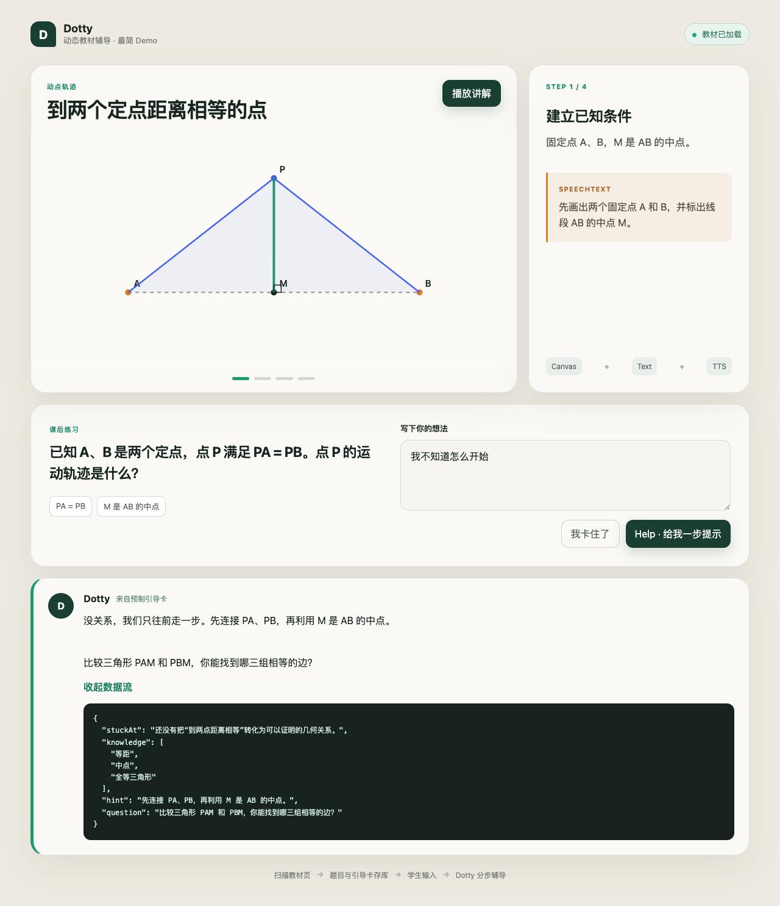

# Dotty Tutor

[](https://github.com/ningkaikok/dotty-tutor/actions/workflows/ci.yml)
[](https://github.com/ningkaikok/dotty-tutor/releases)
[](LICENSE)
[](https://www.python.org/)
[](https://react.dev/)

面向中文教材与个人错题复习的 AI 学习平台。

Dotty Tutor 将 PDF 或扫描教材转换为带来源、公式、题图和审校记录的结构化题目，并通过
分步讲解、选择/多选/判断/填空/数值/简答/画线交互和中文语音，帮助学生完成练习。
项目正在同一技术底座上建设 AI 错题陪练，让学生从错题录入、错误诊断进入多轮辅导和掌握验证。

> 当前项目处于 MVP 阶段，适合本地体验和受控内测，暂不建议将匿名 API 直接暴露到公网。



## 功能

- 根路径提供两个独立产品入口：`/textbooks` 教材互动学习与 `/mistakes` AI 错题陪练。
- 错题陪练支持手机拍照或相册图片、识别范围裁切、OCR/结构化解析和原答案补充。
- 学生可以修正题干、章节、知识点，并确认概念、审题、计算等六类错误原因。
- 错题原图、题目快照、识别记录和确认状态持久化到个人错题本。
- 每道已确认错题拥有独立多轮线程，支持恢复上下文、结构化作答、分层提示和可解释阶段推进。
- 大 PDF 分块上传、暂停续传、页范围批处理和历史教材恢复。
- MinerU OCR、PDF 文字层解析与公式/题图提取。
- Ollama、Codex CLI 和 Mock 三种题目生成路径。
- 文本与视觉双模型审校，以及确定性结构质量门禁。
- 选择题、多选题、判断题、填空题、数值/公式题、简答题和画线题交互。
- 填空题支持多空答案；数值题支持容差；多选题支持完整选项集合校验。
- 基于学生当前答案的分层 Help 提示。
- 可编程课程内容块、可扩展渲染器和分步课程播放器。
- 学习会话、作答记录与知识点掌握度反馈。
- Azure Speech、Qwen3-TTS 和浏览器语音三级回退。
- PostgreSQL JSONB 持久化题目、审校结果和引导卡。

## 工作流程

```text
产品首页
  ├─ 教材互动学习：PDF / 扫描教材 → OCR → 结构化出题 → 审校 → 互动练习
  └─ AI 错题陪练：拍照错题 → 确认归类 → 多轮陪练 → 变式验证 → 复习计划
```

错题陪练当前已完成拍照录题、人工确认、错题本持久化和有状态单题陪练；掌握验证与复习闭环将按
[AI 错题陪练产品规划](docs/mistake-coach-plan.md)逐步交付。

## 技术栈

| 层 | 技术 |
| --- | --- |
| 前端 | React 19、React Router、TypeScript、Vite、KaTeX |
| API | FastAPI、Pydantic、Uvicorn |
| 数据 | PostgreSQL、SQLAlchemy、JSONB、本地文件资源 |
| OCR | MinerU、pypdf |
| 模型 | Ollama、Codex CLI、Mock 回退 |
| TTS | Azure Speech、Qwen3-TTS、Web Speech API |

## 快速开始

本地开发推荐使用“本机服务 + Docker PostgreSQL”：这样可以直接复用本机的 Codex 登录、MinerU
环境和 Qwen3-TTS 模型缓存。

```bash
cp .env.docker.example .env
cp .env.local.example .env.local
# 将 .env.local 的 POSTGRES_PASSWORD 改成 .env 中相同的值
scripts/dev-local.sh
```

打开 <http://localhost:5174>，从首页选择学习入口；也可以直接访问
<http://localhost:5174/textbooks>。完整 Docker Compose 仍适合 CI、演示和发布验证：

最简单的体验方式是使用 Docker Desktop 或 Docker Engine + Compose：

```bash
git clone https://github.com/ningkaikok/dotty-tutor.git
cd dotty-tutor

cp .env.docker.example .env
# 编辑 .env，为 POSTGRES_PASSWORD 设置一个长且只包含 URL 安全字符的随机密码
docker compose up --build --detach
```

打开 <http://localhost:8080>。默认 Compose 使用 Mock 模型，不会下载模型权重；PostgreSQL
和教材文件分别保存在命名卷中。

```bash
docker compose ps
docker compose logs --follow api
docker compose down
```

`docker compose down` 会保留数据卷。完整 Docker 配置、外部模型连接和生产部署说明见
[部署与运维](docs/deployment.md)。

不使用 Docker 时，需要 Python 3.12、Node.js 20+ 和 PostgreSQL：

```bash
python3.12 -m venv .venv
.venv/bin/pip install -r backend/requirements.txt

createuser --pwprompt dotty_app
createdb -O dotty_app dotty_tutor

cp .env.example .env
# 编辑 .env，填写 POSTGRES_PASSWORD 后导出到当前 shell
set -a; source .env; set +a
cd backend
MODEL_PROVIDER=mock REVIEW_PROVIDER=mock VISION_PROVIDER=mock \
  ../.venv/bin/python -m uvicorn app:app --reload --port 8010
```

另开终端启动前端：

```bash
cd frontend
npm ci
npm run dev
```

本地开发地址是 <http://localhost:5174>。完整环境变量、模型和 OCR 配置见
[本地开发指南](docs/development.md)。

## 文档

- [系统架构与调用流程](docs/architecture.md)
- [代码结构、复用决策与扩展指南](docs/codebase-guide.md)
- [AI 错题陪练产品规划](docs/mistake-coach-plan.md)
- [本地开发与模型配置](docs/development.md)
- [API 接口](docs/api.md)
- [可编程课程与学习闭环](docs/programmable-learning.md)
- [部署与运维](docs/deployment.md)
- [日志与运行监控](docs/observability.md)
- [路线图与生产边界](docs/roadmap.md)
- [模型与系统测试报告](docs/model-evaluation-report.md)
- [参与贡献](CONTRIBUTING.md)
- [安全策略](SECURITY.md)
- [支持说明](SUPPORT.md)
- [变更记录](CHANGELOG.md)

## 测试

```bash
.venv/bin/python -m unittest discover -s backend -p 'test_*.py'
cd frontend && npm run build
```

GitHub Actions 会在每次推送和 Pull Request 中运行后端测试、前端构建，以及完整 Docker
Compose 构建和健康检查。

## 项目状态

当前版本已完成教材导入、结构化出题、审校、互动练习、分层提示、TTS 和 PostgreSQL
持久化闭环，并完成双产品入口、错题拍照裁切、错误原因确认、错题本存储和有状态多轮陪练。
连续答对验证和复习队列尚在后续阶段。公网生产部署仍需要用户鉴权、对象存储、异步任务队列、Alembic、
限流、监控和自动备份；详情见[路线图](docs/roadmap.md)。

## 参与开发

请优先通过 Issue 讨论问题和方案，代码修改使用独立分支并通过 Pull Request 合并。提交前请
运行后端测试和前端构建，不要提交 `.env`、模型权重、教材文件、`data/` 或构建产物。

参与前请阅读[贡献指南](CONTRIBUTING.md)和[行为准则](CODE_OF_CONDUCT.md)。安全漏洞请按照
[安全策略](SECURITY.md)私下报告，不要创建公开 Issue。

## 许可证

除非文件中另有声明，本项目的代码和原创文档使用
[Apache License 2.0](LICENSE) 授权。第三方依赖、模型、教材和用户上传内容分别遵循其原始
许可证或权利声明，不因本仓库许可证而自动获得授权。
