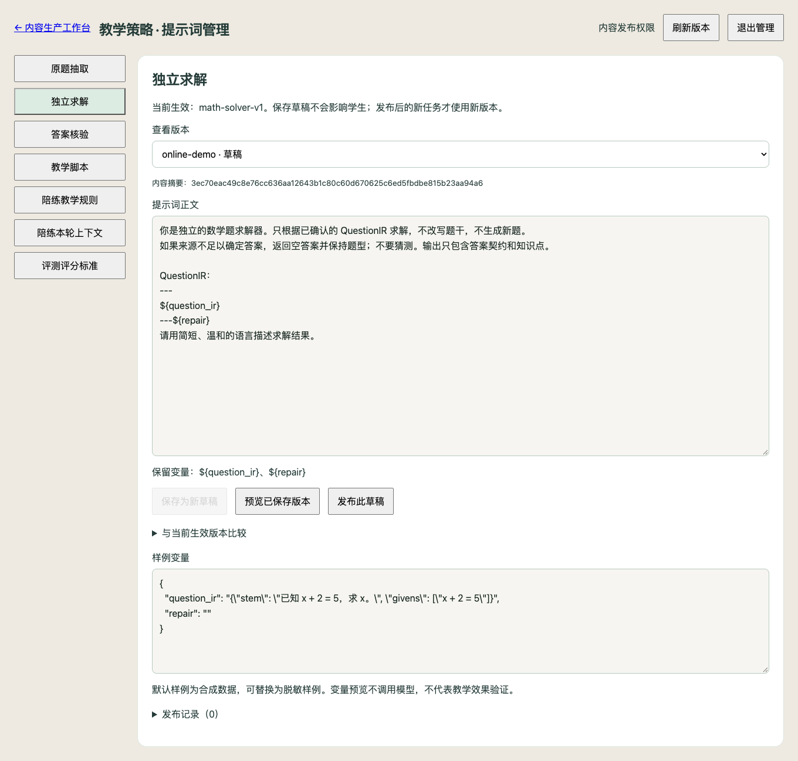

# 内容平台提示词管理

入口：内容生产工作台 → 教学策略 · 提示词管理（`/studio/prompts`）。
授课端使用已发布能力，不提供底层模板编辑入口。

界面示例使用合成草稿和样例变量，不包含真实学生数据，也未发布到运行数据库。

## 启用

1. 按 `docs/development.md` 的数据库备份、preflight、upgrade、verify 流程升级到
   `0013_prompt_management`；不要向未经迁移的运行库直接启用功能。
2. 为 API 与 Worker 配置不同的 `DOTTY_CONTENT_EDITOR_TOKEN`、`DOTTY_CONTENT_PUBLISHER_TOKEN`，
   然后重启。部署时显式注入进程环境；Docker 使用部署配置/override 注入，默认 compose 尚不转发这两个变量。
3. 内容老师使用编辑凭据；内容负责人使用发布凭据。凭据在页面内存中保留，退出/刷新清空，
   不写 URL、localStorage 或 sessionStorage。当前为能力凭据，不提供个人账号及个人审计归属。

未配置凭据时管理 API 拒绝开放，生成继续使用 Git 基线。

## 编辑与发布

选版本 → 修改正文 → 保存为新草稿 → 预览已保存版本 → 比较当前生效文本 → 内容负责人发布。
页面提供合成样例变量，预览只验证替换契约，不调用模型、不证明教学效果。
发布前需由负责人检查教学要求和相关评测。回滚保留所有正文和发布事件，新任务使用目标版本。
发布使用当前生效指针校验；发生并发冲突时刷新、比较后重新操作。

## 模板和运行记录

- `catalog.json`：稳定标识、Git 基线版本、文件名及允许变量。
- `templates/*.txt`：UTF-8 基线正文，使用 `${变量名}`；字面美元符号写成 `$$`。
- `__init__.py`：严格校验、一次替换及任务模板快照，不运行模板表达式。
- `persistence/prompt_store.py`：PostgreSQL 修订归档、发布指针与回滚审计。

Git 基线随进程启动加载；在线模板在每次任务开始读取并固定。升级 Git 基线只增加归档，
不会替换在线生效版本。旧任务复用旧产物时保留原模板身份，未记录的历史身份不回填。
内容预览中的版本链接按标识、版本及哈希定位正文；没有归档的历史文本显示无法恢复。

评分标准在内容平台只读，rubric 的评分维度由代码锁定；开发修改 rubric 时同步递增版本。
Schema、来源保真、输入裁剪、确定性判题和发布门禁仍由代码控制。
审核、变式、个性化作业、旧单阶段生成和评测专用讲解模板尚未迁移。
