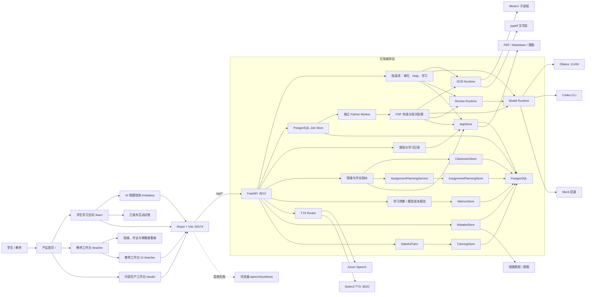
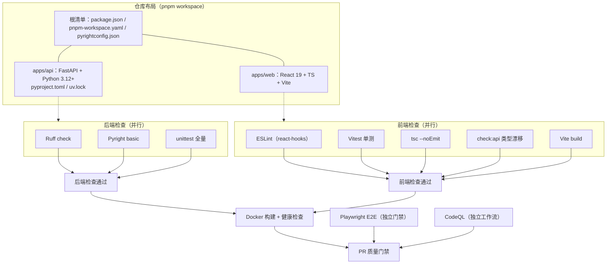
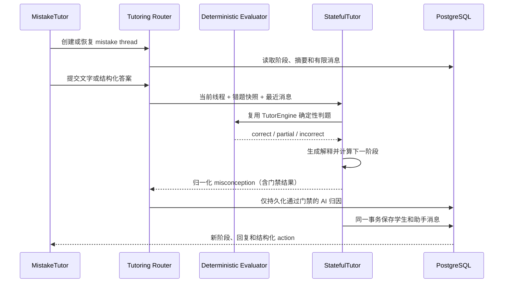
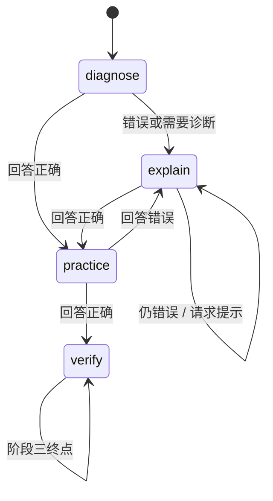
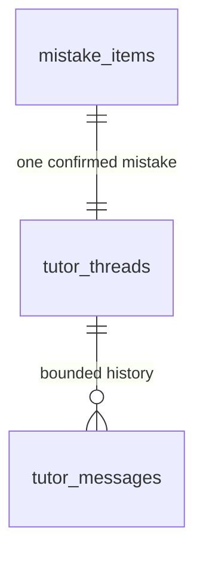
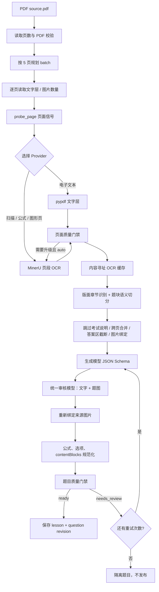

# 系统架构与调用流程

本文描述 Dotty Tutor 当前 MVP 的组件边界、核心调用链、持久化方式和运行限制。产品按角色拆为学生学习
空间、教师工作台和内容生产工作台；AI 错题陪练属于学生空间。各流程共用 OCR、题目生成和数据库基础设施，但保持页面、
路由和业务存储分离。

## 总体架构

项目采用前后端分离结构。React 只通过 `/api` 调用 FastAPI；模型、OCR、审校、存储和
TTS 都由后端编排，浏览器不直接接触模型密钥或本地模型进程。



Vite 开发服务器在 `59174` 端口运行，并把 `/api` 代理到 FastAPI 的 `8010` 端口。
Ollama、MinerU 和 Qwen3-TTS 是可选的独立进程；Azure Speech 是可选外部服务。

当前前端使用 React Router 的声明式浏览器路由，并按产品入口动态加载代码。路由匹配、动态参数、
前进后退和未知路径回退不再由项目自行维护。Vite 开发服务器与生产 Nginx 都会把
`/learn`、`/studio`、`/studio/metrics`、`/teacher`、`/mistakes` 等直接访问回退到 `index.html`。


## 技术栈与工程化总览

仓库为 pnpm workspace 单仓双应用布局；质量门禁在 CI 中强制执行，
本地可通过 pre-commit 获得秒级反馈。



图中同一检查组内的任务可并行执行；Docker 只有在后端和前端检查通过后才运行，E2E 与 CodeQL 分别作为独立门禁。

包管理约定（单一来源）：JS 侧 pnpm（锁文件 `pnpm-lock.yaml`），Python 侧 uv
（依赖声明在 `apps/api/pyproject.toml`，锁文件 `apps/api/uv.lock`）。Docker 与 CI 均使用
同一把锁安装，不再维护范围声明式的 requirements 文件。本地提交前检查见
[development](development.md) 的 pre-commit 说明。

## 组件职责

| 组件 | 主要文件 | 责任边界 |
| --- | --- | --- |
| 产品路由 | `apps/web/src/App.tsx` | React Router 根入口、懒加载与页面标题；不持有教材或错题业务状态 |
| 产品首页 | `apps/web/src/apps/home/ProductHome.tsx` | 展示学生学习、教师和内容生产三个角色入口 |
| 教师工作台 | `apps/web/src/apps/teacher/TeacherClassroomApp.tsx`、`AssignmentComposer.tsx`、`AssignmentPlanReview.tsx` | 生成/审阅班级分析计划，按需生成全班共享的新试卷，确认后指派并查看看板 |
| 学生学习空间 | `apps/web/src/apps/student/StudentLearningApp.tsx` | 汇总互动试卷、错题本和复习入口；不加载生产配置 |
| 已发布试卷播放器 | `apps/web/src/apps/student/PublishedPaperApp.tsx` | 读取已发布试卷、提交作答、离线排队和恢复学习会话 |
| 学生题目工作区 | `apps/web/src/apps/student/StudentQuestionWorkspace.tsx` | 只展示作答、按需提示与学生反馈，不包含生产诊断和重新生成 |
| 学生学习会话 Hook | `apps/web/src/apps/student/usePublishedLearningSession.ts` | 恢复失效会话、持久化离线队列、批量补传和幂等重试 |
| 学生作业队列 | `apps/web/src/apps/student/useStudentTodayQueue.ts` | 读取服务端作业指派，并把已发布试卷保留为自由练习 |
| 内容生产编排 | `apps/web/src/apps/textbook/TextbookApp.tsx` | 教材、当前题目、发布状态和互动预览状态编排；预览不写学习记录 |
| 试卷发布 Hook | `apps/web/src/apps/textbook/usePaperPublication.ts` | 保存课程、创建试卷并约束送审和发布请求 |
| 错题陪练编排 | `apps/web/src/apps/mistake/MistakeCoachApp.tsx` | 错题本、录入、确认子路径和浏览器历史导航 |
| 错题页面组件 | `apps/web/src/apps/mistake/components/` | 图片裁切、错题录入、确认表单和列表 |
| 判题证据展示 | `apps/web/src/components/EvaluationEvidence.tsx` | 复用在陪练、变式、复习和学生试卷反馈中的折叠证据视图；仅展示学生侧已知事实 |
| 教材导入页面 | `apps/web/src/TextbookImport.tsx` | 只组合运行时、教材库、上传和处理链路四个区域 |
| 教材导入状态机 | `apps/web/src/apps/textbook/import/useTextbookImport.ts` | 多文件队列、每项分块续传、独立轮询、并发上限、运行时切换与错误状态 |
| 教材导入组件 | `apps/web/src/apps/textbook/import/` | 文件校验、运行时选择、教材库、队列进度和处理结果展示 |
| 课程播放器 | `apps/web/src/lesson/LessonPlayer.tsx` | 播放、步骤导航、语音和画布动作 |
| 内容块注册表 | `apps/web/src/lesson/rendererRegistry.tsx` | Markdown、公式、图形、动画、标注、练习和提示渲染 |
| 内容预览工作区 | `apps/web/src/components/PracticeWorkspace.tsx` | 内容生产端题目导航、重新生成、质量信息和预览反馈 |
| 题型作答 | `apps/web/src/components/QuestionAnswer.tsx`、`apps/web/src/answerAssembly.ts` | 选择、多选、判断、填空、数值、画线和多小问输入及答案组装 |
| 题目展示 | `apps/web/src/questionPresentation.ts`、`QuestionContent.tsx` | 题干、LaTeX、题图和选项规范化渲染 |
| API 契约 | `apps/web/src/api/`、`apps/web/src/types/` | 按产品域组织请求和类型 |
| 内容渲染 | `QuestionContent.tsx`、`RichText.tsx`、`richTextParser.ts`、`MathText.tsx` | 普通文字、显式 LaTeX、题图和选项 |
| 交互画布 | `DrawLineCanvas.tsx`、`GeometryCanvas.tsx` | 画线作答和几何演示 |
| ASGI 组合根 | `apps/api/app.py`、`apps/api/app_factory.py` | 创建 FastAPI、注册路由和注入共享适配器；不承载业务流程 |
| 教材 HTTP 边界 | `apps/api/routers/textbook_routes.py` | 单页导入、PDF 分块接收、状态查询、资源响应和 Help 接口 |
| 教材处理服务 | `apps/api/application/services/textbook_processing.py` | PDF 合并校验、首批 OCR/生成和后续批次编排，可由 Route 或 Worker 调用 |
| 后台任务用例 | `apps/api/application/textbook_jobs.py` | 把任务 payload 还原为应用服务调用；不复制 OCR 或生成业务流程 |
| Worker 循环 | `apps/api/application/job_worker.py`、`apps/api/worker.py` | 原子领取任务、续租、取消检查、有限重试和最终状态收敛 |
| Job Store | `apps/api/persistence/job_store.py` | 持久化任务、幂等键、租约、运行快照、错误和结果；PostgreSQL 负责并发领取 |
| 应用错误契约 | `apps/api/application/errors.py` | 将业务失败映射为稳定错误码、可重试标记和请求 ID |
| 批次题目处理 | `apps/api/application/services/question_processing.py` | 与 HTTP 解耦的生成、审校、规范化和质量门禁 |
| 教材库路由 | `apps/api/routers/library_routes.py` | 教材列表、恢复和软删除 |
| 教材 OCR 编排 | `apps/api/textbook_ocr_pipeline.py` | 页面探测、连续页段路由、局部 Provider 升级、矢量图页面渲染、结果缓存和审计记录 |
| OCR 路由与缓存 | `apps/api/ocr_pipeline.py` | 页面信号、Provider 选择、内容寻址缓存键和原子缓存文件 |
| OCR 来源质量 | `apps/api/ocr_quality.py` | 页面/题块质量门禁、有限重试建议和隔离决策纯函数 |
| 课程生成 | `apps/api/application/services/lesson_generation.py` | 模型 JSON 生成、稳定题目契约、来源绑定与审校缓存 |
| OCR 题源切分 | `apps/api/domain/questions/source.py` | 按题号切分 Markdown、图片引用匹配和批次上限纯函数 |
| 导入质量报告 | `apps/api/domain/questions/quality.py` | 在整本生成前汇总题数、题号序列、未识别页和图片归属冲突，决定是否允许继续 |
| 应用工厂 | `apps/api/app_factory.py` | FastAPI 初始化、中间件、安全响应头和请求日志 |
| 上传状态注册 | `apps/api/infrastructure/files/upload_registry.py` | 上传任务缓存、恢复、状态更新与 PDF 边界校验 |
| 课程与学习路由 | `apps/api/routers/learning_routes.py` | 课程、学习会话、作答和掌握度接口 |
| 班级路由 | `apps/api/routers/classroom_routes.py` | 班级、成员、作业计划、个性化作业生成、确认式作业指派和教师看板接口 |
| 作业计划服务 | `apps/api/application/services/assignment_planning.py`、`apps/api/domain/assignment_planning.py` | 脱敏聚合、三套错因统计、确定性目标排序、模型受约束表达和 stale/fallback 校验 |
| 个性化作业服务 | `apps/api/application/services/personalized_assignment.py`、`apps/api/application/services/lesson_generation.py` | 复用计划只读上下文，一次批量生成新题，校验题目/答案/来源差异，写入新 publication 并提供幂等最终 plan |
| 试卷发布路由 | `apps/api/routers/publication_routes.py` | 试卷创建、送审、发布、归档和学生可见目录 |
| 可编程课程契约 | `apps/api/domain/contracts/lesson.py` | `LessonDocument`、内容块和学习数据请求校验 |
| 题目契约 | `apps/api/domain/questions/contracts.py` | 模型 JSON Schema、默认示例题和请求/响应模型 |
| 题目流水线 | `apps/api/domain/questions/pipeline.py` | 题型提示词、OCR 规范化、内容块和质量门禁 |
| 确定性判题 | `apps/api/answer_evaluator.py` | 多选集合、填空答案、数值容差和公式文本的可解释核对 |
| 运行时路由 | `apps/api/routers/runtime_routes.py` | 健康检查、模型/OCR 选择、TTS 和学习效果/模型成本联合报告 |
| 模型适配 | `apps/api/infrastructure/runtime/model_runtime.py` | Ollama、Codex CLI、Mock 和 JSON Schema 约束调用 |
| 离线评测 | `apps/api/evaluation/` | 确定性语料重放、Badcase 登记、按需 LLM-as-Judge 报告和前后版本比较；不写生产状态 |
| OCR 适配 | `apps/api/infrastructure/runtime/ocr_runtime.py` | MinerU、页范围识别、产物落盘和 pypdf 回退 |
| 统一模型审校 | `apps/api/infrastructure/runtime/review_runtime.py` | OCR 规范化、文字复核、题图复核和冲突修复；文字与图片复用同一个审核模型选择 |
| 持久化基础 | `apps/api/persistence/base.py`、`database.py`、`schema.py`、`schema_registry.py` | PostgreSQL 引擎生命周期、数据库配置、按领域 metadata 注册和 Upsert；业务运行时不执行 DDL |
| 数据库迁移 | `apps/api/alembic.ini`、`apps/api/migrations/`、`persistence/migration_support.py`、`persistence/migration_cli.py` | 唯一版本链、adoption/增量升级、幂等回填、readiness 检查；PostgreSQL 使用事务 advisory lock |
| 教材与学习存储 | `apps/api/persistence/app_store.py`、`learning_store.py`、`schema.py` | 应用组合 Store 共享引擎；`knowledge_points` 建立发布版本作用域内的实体身份，作答保存 `knowledge_point_id`，掌握度按最新不同题证据派生 |
| 班级与作业存储 | `apps/api/persistence/classroom_store.py`、`schema.py` | 保存班级成员和 plan-backed 作业指派；按 assignment 关联学习会话，追加教师复核证据并聚合有效掌握度与看板指标 |
| 作业计划存储 | `apps/api/persistence/assignment_planning_store.py`、`schema.py` | 保存脱敏输入快照、结构化结果、提醒和 sourceFingerprint；确认计划与创建 assignment 使用同一事务 |
| 掌握度领域算法 | `apps/api/domain/learning/mastery.py` | 规范化旧知识点名称；按 `(publication_id, question_id)` 去重，正确/部分/错误映射为 1/0.55/0，并按 1–5 道不同题提供 0.6–1.0 证据置信度 |
| 可观测性 | `apps/api/observability.py` | JSON 日志、请求 ID、耗时、异常和关键流水线事件 |
| 本地语音 | `apps/api/infrastructure/runtime/qwen_tts_service.py` | 加载 Qwen3-TTS 并提供 `/health` 和 `/tts` |
| 错题路由与契约 | `apps/api/routers/mistake_routes.py`、`apps/api/domain/contracts/mistake.py` | 图片校验、错题确认和稳定错误原因枚举 |
| 错题识别适配 | `apps/api/mistake_recognition.py` | 以依赖注入方式复用 OCR、题目生成和内容块构建 |
| 错题持久化 | `apps/api/persistence/mistake_store.py` | 独立维护 `mistake_items`、append-only `mistake_attributions`、原图路径和错题状态；旧归因列作为兼容投影保留 |
| 多轮辅导 | `apps/api/application/services/stateful_tutor.py`、`apps/api/routers/tutoring_routes.py` | 状态转换、有限上下文和线程 API |
| 辅导持久化 | `apps/api/persistence/tutoring_store.py` | 原子保存每轮消息、摘要、阶段和模型运行信息 |
| 变式验证 | `apps/api/variation_service.py`、`practice_routes.py` | 按错误原因选择策略、限制可判题题型并编排生成与提交 |
| 验证持久化 | `apps/api/persistence/variation_store.py`、`apps/api/persistence/migration_cli.py` | 保存唯一验证题快照、固化归因来源、最新状态投影，以及追加式 `variation_attempts` 验证证据；旧迁移脚本仅作兼容包装器 |
| 模型指标持久化 | `apps/api/persistence/metrics_store.py` | 追加保存逻辑 Runtime 调用的耗时、失败和可选 Token，并提供按时间窗口的只读汇总；不估算货币成本 |
| 间隔复习 | `apps/api/routers/review_routes.py`、`apps/api/persistence/review_store.py` | 幂等排期 1/3/7 天任务，保存复习题、作答证据并聚合进度 |

## 错题录入与确认

```text
浏览器选择或拍摄单张图片
  → Canvas 按学生选择裁切
  → POST /api/mistakes/import
  → 原图写入 data/mistakes/{mistakeId}
  → 复用 MinerU OCR 与结构化题目生成
  → mistake_items 保存题目快照和运行信息（待确认）
  → 学生修正题干、学段、章节、知识点和原答案
  → 可选填写学生自评错误原因并 PATCH 确认（待掌握）
```

错题域使用独立 `MistakeStore` 和 SQLAlchemy metadata，避免继续扩张应用组合 `AppStore`。它与教材域
共享数据库引擎和数据根目录，但没有把错题生命周期耦合到教材批次表。确认后的错题可以创建唯一
辅导线程。完成陪练后，独立的 `VariationStore` 保存唯一验证题和结构化作答，避免自由对话被误算为掌握证据。
`error_reason` 的语义是学生自评归因；陪练首轮的学生输入由模型提出 `misconception`，其中
`category` 与证据、置信度一起经过既有门禁。陪练路由只在 `needsConfirmation=false` 时把
`category`/`confidence` 写入 `ai_error_reason`/`ai_error_reason_confidence`，否则保留既有 AI 判断。
变式策略优先使用本轮通过门禁的 AI 归因，其次使用学生自评，最后仅在策略选择时回退 `unknown`；
该来源记录在 `errorStrategy.source`，便于回放审计。前端在学生完成或跳过自评后，才把线程中最后一条可信 AI 归因与学生自评并列展示；
两者都没有时不渲染对照区块。每次验证提交先追加 `variation_attempts`，再更新同一道题的最新状态投影；答错时允许修正但不覆盖原证据。
答对一次时 `MistakeStore` 只负责执行明确的 `unmastered → mastered` 状态转换。前端据此将题目分到错题本或进阶本，不保存第二份题目副本。
掌握转换成功后，`ReviewStore.schedule` 以该次作答时间为锚点创建三个唯一任务。复习任务保存自己的题目
快照、答案和确定性判题证据，不参与首次掌握连续计数；复习作答的响应和后续读取都会带上 `evaluationEvidence`；`/api/mistakes/{mistakeId}/evidence` 汇总错误原因、策略、验证证据和复习任务，
`/api/progress` 只从服务端证据实时聚合验证正确率、复习完成率和发布版本内同知识点再错率。

## 有状态单题陪练



状态转换由代码控制，而不是交给模型自由决定：



阶段三不会写入 `mastered`。阶段四必须生成不同变式并连续验证正确后，才能更新掌握状态。



线程摘要最多保留 2,000 个字符；模型提示只包含摘要尾部、最近六条消息以及当前错题信息。数据库可
保留更多审计消息，但读取 API 默认最多返回 40 条，避免页面和模型上下文无限增长。

## 页面初始化

根路径和 `/learn` 只渲染导航，不调用生产端接口。进入 `/studio` 后，上传页首次加载时并行调用：

1. `GET /api/models`：探测 Ollama 模型并返回可用生成方式。目录同时携带能力元数据（`modelDetails`：角色、json-schema/vision/math/long-context 能力标签、上下文上限、延迟与成本级别、回退建议）和轻量健康状态（连续失败计数 + 最近失败原因，成功即复位）；健康只影响候选筛选，绝不覆盖已开始运行的 `RunSnapshot`。
2. `GET /api/ocr`：探测 MinerU，计算 `auto` 实际使用的解析器。
3. `GET /api/library`：从 PostgreSQL 恢复已完成教材。

模型和 OCR 选择目前写入当前 FastAPI 进程的全局运行时，不按用户或教材隔离。

## 单页导入

`POST /api/textbook/import` 是快速体验路径：

```text
浏览器校验文件（最大 10 MB）
  → FastAPI 读取内容
  → 手工原文优先，否则使用 MinerU / PDF 文字层
  → 生成一道题、四步讲解和三层引导卡
  → 返回 QuestionPayload
```

该路径不持久化原文件，也不执行完整 PDF 路径中的来源绑定、统一模型审校和质量门禁。

## 整本 PDF 导入

完整 PDF 使用可续传路径：

1. 浏览器检查 `%PDF-` 和 `%%EOF`，文件最大 500 MB。
2. `POST /api/uploads/init` 创建任务和资源目录。
3. 浏览器按 5 MB 调用分块上传接口，暂停后只补传缺失块。
4. `POST /api/uploads/{uploadId}/complete` 使用幂等键创建 `queued` 任务，快速返回 `202 + jobId`。
5. 独立 Worker 领取租约后合并文件并校验大小、SHA-256 和页数；随后每 5 页规划一个批次，删除已合并分块并保留 `source.pdf`。
6. 首批先读取每页文字层和图片数量，计算扫描、公式和图形信号；电子文本页默认走 pypdf，扫描页、公式页
   或含“如图/左视图/展开图”等视觉提示的页面优先走 MinerU。
7. 自动模式下，pypdf 页面先经过页面质量门禁；空文字、疑似扫描或内容损坏的页段局部升级到 MinerU。
   显式选择 pypdf 时不偷偷升级，显式选择 MinerU 时按连续页段执行。Provider 不可用时保留回退原因，
   不把“识别成功”伪装成高质量结果。
8. 每个 Provider 页段按 PDF 内容哈希、起止页、Provider 和流水线版本生成缓存键，缓存 Markdown、图片 URL
   和运行元数据；重复处理默认命中缓存，只有“刷新 OCR 重生成”才跳过缓存。
9. 将 Markdown 按题号切分，合并跨页续题，截断答案/解析章节，并把题号、页码和图片引用绑定到稳定的
   `sourceQuestionKey`。上传完成任务默认自动执行整卷流水线；已有预览任务也可以显式触发整卷任务，每批最多扩展到
   20 题，避免一次模型调用过大。
10. 每道题进入独立生成循环：结构化生成 → 来源绑定 → 审核 → 确定性规范化 → 内容块重建 → 质量门禁。
    质量失败时只携带当前题的错误证据重试，最多额外重试 1 次；最终仍失败的题目保留给工作台诊断并隔离，
    不进入学生可见发布。
11. 批次结果写入课程文档、题目当前视图和 revision 审计链；任务成功时保存结果，失败时保存结构化错误。
12. 前端每 800 ms 查询 `/api/jobs/{jobId}` 与上传领域状态，分别展示多个文件的任务进度；后续批次也通过 `202` 任务执行。
13. 上传完成任务会在首批校验后继续调用整卷编排；也可调用 `POST /api/uploads/{uploadId}/full-paper` 恢复或补跑整卷生成。服务端最多处理 50 页、100 道题，
    运维可通过 `DOTTY_MAX_FULL_PAPER_PAGES`、`DOTTY_MAX_FULL_PAPER_QUESTIONS` 进一步降低上限，但不能突破硬限制。
    每批复用 OCR 缓存和 `process_batch`，成功批次由稳定 `sourceQuestionKey` 持久化；Worker 重试跳过已成功批次，单批异常记录在
    `summary.batches` 后继续。`totalBatches`、`processedBatches`、`succeededBatches`、`failedBatches`、
    `quarantinedQuestions`、`skippedBatches`、`questionCount` 和 `limitReached` 组成可恢复结果汇总。整批重生成会替换
    题目当前视图并清除不再存在的旧题，但保留不可变 revision 审计链。

取消采用协作式边界：排队任务直接收敛为 `cancelled`，运行任务设置 `cancel_requested`，应用服务在合并、OCR
和题目循环的安全点终止。Worker 必须持有有效租约才可提交成功或失败，避免进程暂停后由旧执行者覆盖新结果。

## 运行治理的当前边界与目标

当前系统已经具备统一模型适配、OCR 页面路由、不可变运行快照、PostgreSQL `background_jobs`、单 Worker、
领域状态机、结构化日志和请求 ID。PDF 完成与批次处理已经脱离 HTTP 请求；它是模块化单体中的可恢复任务，
不是 Redis 队列、分布式调度平台或 Agent 编排框架。

下一阶段按以下最小边界演进：

- **Run Snapshot**：运行开始时固定生成模型、审核模型、OCR、提示词、Schema 和校验器版本；后续切换只
  影响新运行。
- **Run Events**：使用 `run_id` 串联 OCR 路由、局部重试、生成、审校、隔离、发布和结束事件。
- **PostgreSQL Job Store（已完成）**：使用独立任务表和单个 Worker 执行 PDF/OCR/批量生成，HTTP 返回
  `202 + jobId`；支持幂等、取消、有限重试和租约恢复，不预先引入 Redis。
- **离线评测**：`evaluation.replay` 无模型重放确定性语料；`evaluation.judge_cli` 按需调用独立审核模型。
  Judge 报告固定记录语料版本、样本哈希、审核模型/Prompt 版本、每样本成功率/耗时/逻辑调用数/Provider
  实际尝试数/token/Schema 降级，以及聚合 `judgeMetrics`。`evaluation.compare` 对确定性报告做结构回归，
  对 Judge 报告只比较配置一致时的共同成功样本配对评分；评分变化不自动阻断。测试不依赖真实模型调用。
- **轻量 Model Gateway**：在现有 Runtime 上统一请求与结果字段，显式记录实际 Provider、Model、回退和
  错误，而不是新增独立服务。

完整阶段、验收标准和何时升级 Redis、OpenTelemetry、LangGraph 或 MCP，见
[AI 运行治理与后台任务演进计划](runtime-governance-plan.md)。

## OCR 到题目：一条请求的实际流水线

下面的流程描述的是 `TextbookProcessingService` 和 `question_processing` 当前真正执行的顺序。它把“识别”
与“出题”拆成两个边界：OCR 只负责还原来源，模型只负责提出候选结构，最终能否发布由确定性门禁决定。



### 1. 页面路由与 OCR

`apps/api/ocr_pipeline.py` 只做低成本决策，不直接启动 OCR。`probe_page` 根据文字长度、PDF 图片数量、
公式命令和图形提示计算页面信号：

- `pypdf`：电子文本且没有明显公式/图形依赖时，速度快，输出文字层。
- `MinerU`：扫描页、公式页、图形页或视觉提示明显时，输出 Markdown、LaTeX 和图片资源。
- `auto`：先用 pypdf 预检，质量状态为 `retry` 时只升级失败页段；不会重新处理整本 PDF。
- `ocr_preflight.classify_page` 在路由前对每页做互斥主类别分类（空白/出版信息/公式密集/图文混排/
  疑似题目/无图纯文字），逐页携带命中原因随 `pageRoutes` 持久化，批次聚合写入 `ocrRun.preflight`
  脏页摘要。预检参与路由的位置只有一处：空白页（无文字层且无图片对象）在 auto 模式跳过 MinerU
  升级——扫描页绝不误跳过。预检不删除任何页面，质量门禁和局部重试不变。

`apps/api/textbook_ocr_pipeline.py` 再把相邻且 Provider 相同的页面合并成连续 span，调用
`OcrResultCache` 保存结果。缓存命中仍会返回 `pageRoutes`、`quality`、`retries` 和 `spans`，因此页面能够解释
“为什么使用这个 Provider”，而不是只返回一段不可追踪的 Markdown。

### 2. 从 Markdown 到稳定题块

`apps/api/domain/questions/source.py` 负责题源切分。它采用“版面信号优先、语义黑名单兜底、题号白名单落块”的
两阶段策略：

1. 先匹配“选择题/填空题/解答题”等章节标题；标题中的空格和 OCR 换行会被容忍，例如“一 、 选\n择 题”。
2. 章节标题缺失或落在上一页时，对题号候选块检查“注意事项、准考证、答题卡、考试时间、涂黑”等考试说明信号，
   跳过说明块后再开始切题；题号重复不能作为去重依据，因为说明和真实第 1 题都可能使用 `1.`。
3. 只把题号行作为候选起点；相邻同号跨页内容会合并，图片引用按来源顺序去重；遇到答案、解析或答案章节会截断。

`apps/api/domain/questions/pipeline.py` 还会在模型调用后的统一质量门禁中再次检查题源。疑似考试说明的来源即使被
模型包装成合法 JSON，也会以 `needs_review` 隔离，不进入学生可见发布。`limited_question_sources` 继续限制单批最多
5 题，避免一次模型请求过大。

这条边界不是只依赖提示词：提示词负责约束模型，确定性切分负责降低误切，发布门禁负责最后兜底。这样 OCR 变形、
分页丢标题或模型误解时，都会留下可解释的失败证据。

处理服务会为每个题块保留：

- `sourceQuestionKey`：批次、题号和索引组成的稳定定位键；
- OCR 原始题块和 `sourceHash`；
- 页码范围、OCR Provider、缓存键和图片引用；
- `sourceArtifactUrl`、`promptArtifactUrl`，方便在内容生产端查看原文和送给模型的提示。

题目切分规则有独立版本号（当前为 `question-segmentation-v4`）。已生成的 `source.md`、`model-prompt.md` 和题目
revision 是不可变证据；规则修复不会偷偷改写历史产物，必须通过“刷新 OCR/重新生成”创建新 revision。这能区分
“代码已修复但页面仍展示旧结果”和“新运行再次误切”两类问题，也便于回放同一份 OCR 输入。

这里的“切题”不是单纯的正则分割：题型章节标题允许 OCR 空格/换行；标题缺失时先用考试说明语义黑名单跳过
“注意事项、准考证、答题卡、涂黑”等前置块，再以题号白名单创建候选题。模型生成前后的门禁都保留这条来源边界。
这样做是业界常用的“版面分区 + 文档分类 + 结构化校验”组合，能避免把看似合法的考试说明 JSON 当成题目。

### 3. 生成、统一审核与确定性修复

```text
题块 + 来源图片
  → 生成模型前将 Markdown 图片引用替换为 `⟦IMG_N⟧` 占位符
  → 生成模型（JSON Schema）输出题干、选项、答案、四步讲解和引导卡
  → 确定性校验占位符数量与顺序，再恢复原始图片引用
  → attach_question_source 绑定题号、页码、题干图和选项图
  → 统一审核模型检查文字、公式、单位、讲解，以及题干图/选项图的归属和事实
  → 审核后再次绑定来源图片，防止模型删除图片或把文件名写进正文
  → 确定性规范化：公式命令、选项标签、图片顺序、contentBlocks
  → 质量门禁：题号、选项数量、答案泄漏、图片归属、公式环境和语义冲突
```

文字审核和图片审核不是两个可独立选择的模型。`ReviewRuntime` 使用同一组
`REVIEW_PROVIDER`/`REVIEW_MODEL`，但在有图片时会产生独立的 `textModelRun` 和 `visionModelRun` 审计记录，
这样可以分别定位文字检查和视觉检查耗时，同时保证同一题的裁判模型一致。视觉冲突还会触发一次讲解复修；
复修仍使用同一个审核模型，不会悄悄切换到另一个模型。

质量门禁发现“来源只有 A-D、模型却生成 E”时，会暂时隐藏多余选项并标记 `needs_review`；这只是可逆的工作台
诊断修复，不代表题目通过。只有重新生成/修复后门禁为 `ready`，题目才允许送审或发布。

## 单题生成与审校

```text
OCR 题块 + 来源图片
  → 生成模型前将 Markdown 图片引用替换为 `⟦IMG_N⟧` 占位符
  → 生成模型按 JSON Schema 输出候选题
  → 确定性校验占位符数量与顺序，再恢复原始图片引用
  → attach_question_source 绑定来源
  → 同一个审核模型以相同占位符执行文字审核；有图片时继续执行视觉审核
  → 审校返回后再次校验并恢复图片引用
  → 审核后再次绑定来源，避免模型改坏图片归属
  → 确定性修复公式、`(A)`/`A.` 等选项标记和图片结构
  → 构建 contentBlocks
  → 质量门禁校验来源、图片顺序、选项、公式命令和单位语义
  → 失败时携带校验错误仅重新生成当前题（最多额外 1 次）
  → 通过后写入 PostgreSQL 和 revision 审计链；失败则隔离
```

质量门禁发现错误时会把 `publicationStatus` 标记为 `needs_review`，流水线使用同一份 OCR 来源和题图
局部重试，不重复处理整本 PDF。模型或审校服务不可用时立即熔断，避免把网络超时放大为多次等待。
重试后仍失败的候选题会被隔离；发布接口自动发布其余合格题。若整份试卷没有任何合格题，则保持
`in_review` 并返回结构化错误，同时记录 `publication.quality.blocked` 供开发排查。

模型输出不是最终真相。即使第一遍生成使用能力较强的模型，后续审校仍可能把正确的 `\%`、摄氏度等
LaTeX 改写成 KaTeX 不支持的字面命令。因此流水线在所有模型之后执行确定性规范化，并把“题干使用百分比、
选项却全部是温度值”这类无法安全猜测的冲突标记为 `needs_review`，而不是静默改题或发布。

生成模型和统一审核模型是两个独立进程级 Runtime。工作台分别调用 `/api/models/select` 和
`/api/review-models/select`；切换审核模型不会改变 Help 或题目生成模型。整套重新审核不会直接改写旧
`lesson_documents`，而是让处理服务以 transient 模式重新运行来源批次，再用新题目 ID 创建下一版
`lesson_publications`。旧版、学习会话和作答记录因此仍能回放和回滚。

## 后续批次与重新生成

- 下一题已经在前端题库时只切换本地状态。
- 到达未处理批次时，前端按需调用批次处理接口。
- 后续批次会额外读取前一页，补齐跨页题干。
- 已有匹配 PDF 内容哈希、页范围和 Provider 版本的 OCR 结果时复用缓存；升级 Provider 后自动使用新缓存键。
- `force=true` 会跳过已保存题目并重新调用生成/审核流水线；OCR 中间结果仍按内容哈希复用，避免重复解析 PDF。
  每次成功生成都会获得新的题目修订 ID，但 `sourceQuestionKey` 保持稳定，便于批次定位和历史版本追踪。
- 内容生产工作台的“修复本题”调用 `/api/uploads/{uploadId}/questions/{sourceQuestionKey}/regenerate`，只重跑当前题的生成、审校和质量门禁，默认复用 OCR 缓存；同批其它题目和排序不变。
- 当页面本身疑似识别错误时，内容生产者可使用“刷新 OCR 重生成”或在批次接口传 `refreshOcr=true`。这是显式的整批 OCR 刷新操作，不会让每次单题修复都重复运行 MinerU。
- 图片绑定在审核后再次依据 OCR 原始引用顺序重建。对于“题干图 + A-D 四张选项图”，四张选项图会写入
  `optionImageUrls` 和 options 内容块，模型误写的 `images/...` 文件名不会泄漏到学生页面；当前数据必须以
  `contentBlocks`、`imageUrls` 和 `optionImageUrls` 为图片事实来源。
- 题干里的图片引用清理对**每一道题**生效，而不只是 A-D 图片选择题。清理发生在
  `apply_question_quality_gate()` 内、构建 `contentBlocks` 之前；`build_question_content_blocks()`
  和 `replace_question_prompt()`（错题确认改写题干）必须使用同一个解析入口 `_prompt_content_blocks()`。
  两条路径各自实现一套解析规则，正是图片路径和表格标签反复以文字形式泄漏到学生页面的原因。
- 题干图按其在题干中出现的位置就地渲染，而不是整批贴在文字之后。清理图片引用时会同时记录
  每张图在清理后文本中的偏移（`extract_image_placements`），内容块据此在原位插入 `image` 块。
  只有当记录到的位置覆盖全部题干图、且顺序与 OCR 来源一致时才启用；任何不一致都回退到整批追加，
  宁可版式不理想也不要把图放到错误位置。生成和文字审校模型看到的是 `⟦IMG_N⟧` 占位符，返回后
  才恢复为原始 Markdown；占位符丢失或乱序会被质量门禁标记为 `needs_review`。
- MinerU 会把统计表输出成原始 `<table>` HTML。这类内容由后端用标准库 `html.parser` 解析成结构化
  `table` 内容块，并保留在题干中的原始位置；前端只渲染结构化块，不做 HTML 解析。
  `prompt` 字段仍保留原始 OCR 文本作为来源审计事实，只有 `contentBlocks` 会渲染给学生。
- PDF 中的几何线框图、统计图等矢量对象不一定能被 `pypdf` 或 MinerU 当作图片提取。页面文字出现
  “如图/左视图/转盘”等视觉提示且没有局部资源时，OCR 编排器会用 `pdftoppm` 渲染对应页，
  将渲染图放入题块并记录到 `ocrRun.imageUrls`；这是一张页面级兜底图，不伪造不存在的局部裁剪。
- 当 `content_list.json` 同时提供题号文字块与图片/图表的 `page_idx`、`bbox`，且 Markdown、结构化图注都没有
  明确归属时，`source.py` 才使用同页垂直区间和栏位证据尝试绑定图片。置信度不足或候选接近时保持未绑定，
  在 `imageAttributionAudit` 中记录候选、分数和 `needs_review`，整卷质量报告会阻断继续生成，避免把相邻题目的图静默贴错。

### 多小问答案边界

模型输出中的 `subQuestions` 是可选结构；每个小问有稳定 `id`、题型、独立 prompt 和 `evaluation.mode`。
`deterministic` 小问携带自己的 `answerSpec`/答案字段并复用统一判题器，`tutor` 小问只保留学生作答和陪练上下文。
质量门禁拒绝“检测到多小问但缺少结构”以及父题答案与小问答案并存的载荷。前端按小问维护答案映射，后端返回
逐小问状态；`evaluationSummary.masteryEligible` 是本轮可解释摘要，掌握度投影不信任客户端字段，而是从已发布题目
契约重新判断 tutor-only 边界。确定性小问的正确和错误都保留为学习证据，含 tutor 小问的整题不进入 mastery。
- 前端快速预览模式最多展示 5 道题；整卷生成模式上限为 100 题（`FULL_PAPER_QUESTION_LIMIT`）。

## 学生作答与 Help

前端向 `POST /api/help` 提交学生文本、提示层级、作答模式和画线结果；多小问额外提交
`interactionResult.subQuestionAnswers`：

1. 多选题比较 `selectedOptions` 与 `correctAnswers` 的完整集合。
2. 填空题逐空比较文本、数值或公式答案，可配置 `tolerance` 和 `unit`。
3. 数值题使用 `answerSpec` 做数值容差或等价文本核对。
4. 判断题优先使用明确答案做确定性判题。
5. 画线题比较 `requiredConnections` 与学生连接集合。
6. 多小问逐项判定；开放性小问只生成陪练反馈，不产生客观正确分。
7. 其他题先检查学生等式是否与题干或标准步骤冲突。
8. 真实模型结合标准步骤、当前引导卡和学生输入生成下一步反馈。
9. 模型不可用时回退到已存三层引导卡，每次最多推进一级。

判定完成后，前端将作答、耗时、提示层级和判定写入当前互动试卷学习会话；后端同步更新知识点掌握度，
并把 `incorrect` / `partial` 作答幂等写入个人错题本。前端在学习证据卡显示当前知识点分数与累计作答，
答错时给出错题本入口；离线记录补传后走相同自动归档逻辑。详细契约见
[可编程课程与学习闭环](programmable-learning.md)。

## TTS 回退

```text
POST /api/tts
  → Azure 凭据完整：Azure Speech Neural
  → 否则尝试 Qwen3-TTS :8020
  → API 失败：浏览器 speechSynthesis(zh-CN)
```

`GET /api/tts/status` 返回当前可用 provider。浏览器回退发生在前端，不是后端音频服务。

## 持久化

- `upload_jobs.result_json` 保存上传任务和教材结果。
- `batch_questions.payload_json` 保存结构化题目和审校信息。
- `guide_cards_json` 保存分层提示。
- `lesson_documents` 保存带版本的课程内容块。
- `learning_classes`、`class_memberships` 和 `assignments` 保存本地班级、学生名单和不可变发布版本指派；
  `assignment_plans` 保存教师确认前的脱敏分析草稿，`assignments.assignment_plan_id` 将正式作业绑定到唯一确认计划；
  `learning_sessions.assignment_id` 将学生学习会话绑定到具体作业，旧的自由练习会话允许为空。
- `learning_sessions.publication_id` 绑定整份互动试卷；`knowledge_points` 使用发布版本和规范化名称生成稳定
  `knowledge_point_id`，`exercise_attempts` 保存服务端解析出的题目归属，`mastery_states` 以
  `(learner_id, knowledge_point_id)` 为键保存 `raw_score`、`score`、`evidence_confidence`、`evidence_count`、
  `algorithm_version` 和 `computed_at` 等掌握度投影。重复作答仍保留在日志中，但派生时每个发布版本的每道题只
  取最新作答，因此离线乱序不会污染结果。
  `teacher_review_events` 追加保存教师对具体判定的复核/推翻和知识点掌握度覆盖；教师覆盖参与看板有效投影，
  但不会删除或改写原始作答、AI 判定或 mastery-v2 证据。

作业布置链路是 `POST /api/classes/{classId}/assignment-plans` → 教师审阅 →
`POST /api/classes/{classId}/assignments`。计划输入按班级成员聚合，掌握度按
`normalized_name` 形成临时 planningTopicKey；无证据学生计入 `notObserved`，不参与平均分。
模型只能表达/排序已存在的目标和 evidenceRef，非法 JSON、超时或虚构引用会回退确定性规则，且不会
直接创建 assignment。确认请求必须带 `planId`、`sourceFingerprint` 和提醒确认值；标题、截止日期可在
确认前修改，不会改变分析指纹。
- `mistake_items` 保存错题快照、学生原答案、章节知识点、学生自评 `error_reason`、通过门禁的 AI
  `ai_error_reason`/`ai_error_reason_confidence` 和确认状态；跳过自评不写入 `unknown`。
- `mistake_attributions` 保存 `self`/`ai`/`teacher` 的追加式归因、置信度、证据 JSON、模型版本和接受时间。
  历史列通过确定性主键只回填一次；`MistakeStore.confirm` 与 `update_ai_error_reason` 在同一事务内同时更新
  旧列和新表，读取旧 API 仍保持不变。
- `tutor_threads` 保存每道错题的当前阶段、摘要、提示层级和消息计数。
- `tutor_messages` 保存学生/助手消息、确定性判定、结构化动作和模型运行记录。
- `variation_exercises` 保存验证题和最新答案状态；`variation_attempts` 追加保存每次验证作答、`EvaluationEvidence`、判定和时间，网络重试按 `attempt_id` 幂等。
- JSON 文档在 PostgreSQL 中使用 JSONB。
- `data/uploads/{uploadId}/source.pdf` 保存合并后的原 PDF。
- 批次资源目录保存 OCR Markdown、模型提示词和题图。
- `data/mistakes/{mistakeId}/` 保存错题原图和识别产生的题图。
- 内存中的任务和题目只作为读取缓存，未命中时从 PostgreSQL 恢复。

### Schema 生命周期与隔离

数据库设计从本地文件/SQLite 快速开发到当前 PostgreSQL + Alembic 治理的完整演进记录见
[数据库设计与治理演进](database-evolution.md)。当前权威边界是：PostgreSQL 作为正式运行时唯一数据库，
Alembic 作为 schema 版本权威，SQLAlchemy metadata 只描述当前模型，业务进程不得执行 DDL。

正式入口是 `cd apps/api && uv run python -m persistence.migration_cli <command>`，可用命令为
`current`、`head`、`preflight`、`upgrade` 和 `verify`。`preflight`/`verify` 只读且输出不包含连接串；
PostgreSQL 的业务请求不会补表或加列。健康检查会在连接可用但 schema 落后时返回 `503` 和
`SCHEMA_OUT_OF_DATE`，并返回缺失外键、orphan count 以及按列/索引/外键分类的 `autoFixable`/`manualActionRequired`，避免业务查询先触发缺列 `500`。PostgreSQL 迁移添加
 assignment 外键前会拒绝非空 orphan 数据；schema 不完整时报告会保持 not-ready，并要求先完成正式迁移。

每个 worktree/session 必须使用独立可写 PostgreSQL 数据库；测试使用独立
`DOTTY_TEST_POSTGRES_ADMIN_URL` 创建的一次性数据库。不要让多个 worktree 共享同一个可写开发库；迁移发布顺序为
`backup → preflight → upgrade → verify → deploy/restart`。

生产版本边界和改造优先级见[路线图](roadmap.md)。
错题域的数据模型、智能体状态机和代码复用边界见
[AI 错题陪练产品规划](mistake-coach-plan.md)。

当前架构以仓库实际布局与本文件为准；后续演进项（worker 拆分、可观测性、对象存储等）
统一记录在 [路线图](roadmap.md) 与 [engineering-roadmap](engineering-roadmap.md)，
不再维护外部架构图，避免与代码脱节。
### 班级个性化作业 MVP

`POST /api/classes/{classId}/assignment-plans/{planId}/personalized` 复用 `AssignmentPlanningService` 的只读聚合上下文，
只把学科、学段、班级聚合 mastery/错因、目标、无身份 evidenceRefs 和来源题示例交给独立的 lesson-generation 契约。
模型必须一次返回 1–5 道带 `planningTopicKey + LESSON_SCHEMA` 的新题；服务端拒绝回退、复制来源题、不可确定判题、答案不完整或质量门禁失败。
通过后保存带 `sourcePlanId`、`sourcePublicationId`、`planningTopicKey`、证据引用和 schema/prompt 版本的 lesson，创建不同于来源的 published publication，
再保存一个可继续确认的 final plan。来源 plan 记录 final plan ID，重复请求不重复模型调用或 publication；确认阶段仍进入现有 `assignments` 事务。
