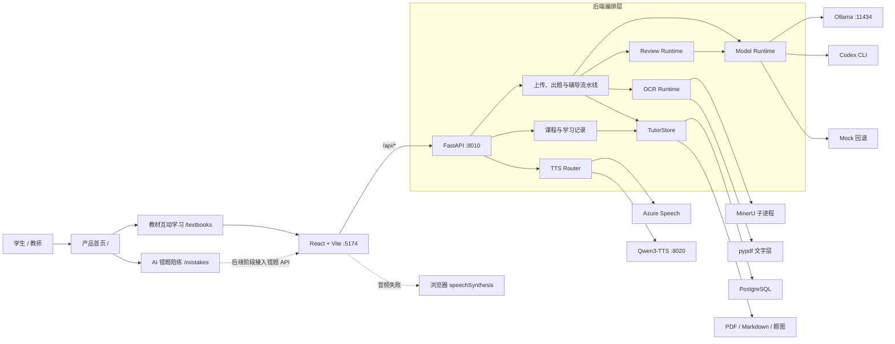

# 系统架构与调用流程

本文描述 Dotty Tutor 当前 MVP 的组件边界、核心调用链、持久化方式和运行限制。产品包含教材互动学习
和 AI 错题陪练两个入口；第一阶段共用前后端基础设施，但保持页面和业务流程分离。

## 总体架构

项目采用前后端分离结构。React 只通过 `/api` 调用 FastAPI；模型、OCR、审校、存储和
TTS 都由后端编排，浏览器不直接接触模型密钥或本地模型进程。



Vite 开发服务器在 `5174` 端口运行，并把 `/api` 代理到 FastAPI 的 `8010` 端口。
Ollama、MinerU 和 Qwen3-TTS 是可选的独立进程；Azure Speech 是可选外部服务。

当前前端使用轻量 History API 路由，不增加路由运行时依赖。Vite 开发服务器与生产 Nginx 都会把
`/textbooks`、`/mistakes` 等直接访问回退到 `index.html`。第一阶段的 `/mistakes` 是独立产品骨架，
尚未增加错题数据库表和后端接口。

## 组件职责

| 组件 | 主要文件 | 责任边界 |
| --- | --- | --- |
| 产品路由 | `frontend/src/App.tsx` | 根入口、History API 路由与页面标题；不持有教材或错题业务状态 |
| 产品首页 | `frontend/src/apps/home/ProductHome.tsx` | 展示教材学习与错题陪练两个独立入口 |
| 教材页面编排 | `frontend/src/apps/textbook/TextbookApp.tsx` | 教材、当前题目、会话和跨组件状态编排 |
| 错题陪练入口 | `frontend/src/apps/mistake/MistakeCoachApp.tsx` | 第一阶段产品骨架和后续学习流程说明 |
| 上传与模型选择 | `frontend/src/TextbookImport.tsx` | 文件校验、分块续传、进度轮询、运行时选择和教材库入口 |
| 课程播放器 | `frontend/src/lesson/LessonPlayer.tsx` | 播放、步骤导航、语音和画布动作 |
| 内容块注册表 | `frontend/src/lesson/rendererRegistry.tsx` | Markdown、公式、图形、动画、标注、练习和提示渲染 |
| 练习工作区 | `frontend/src/components/PracticeWorkspace.tsx` | 题目导航、作答、质量信息和辅导反馈 |
| 题型作答 | `frontend/src/components/QuestionAnswer.tsx` | 选择、多选、判断、填空、数值和画线输入 |
| 题目展示 | `frontend/src/questionPresentation.ts`、`QuestionContent.tsx` | 题干、LaTeX、题图和选项规范化渲染 |
| API 契约 | `frontend/src/api.ts`、`frontend/src/types.ts` | `/api` 请求封装和前后端类型 |
| 内容渲染 | `QuestionContent.tsx`、`MathText.tsx` | 文字、LaTeX、题图和选项 |
| 交互画布 | `DrawLineCanvas.tsx`、`GeometryCanvas.tsx` | 画线作答和几何演示 |
| API 入口与上传编排 | `backend/app.py` | 教材上传、PDF 批次和跨模块调用编排 |
| 应用工厂 | `backend/application.py` | FastAPI 初始化、中间件、安全响应头和请求日志 |
| 上传状态注册 | `backend/upload_registry.py` | 上传任务缓存、恢复、状态更新与 PDF 边界校验 |
| 课程与学习路由 | `backend/learning_routes.py` | 课程、学习会话、作答和掌握度接口 |
| 可编程课程契约 | `backend/lesson_contracts.py` | `LessonDocument`、内容块和学习数据请求校验 |
| 题目契约 | `backend/question_contracts.py` | 模型 JSON Schema、默认示例题和请求/响应模型 |
| 题目流水线 | `backend/question_pipeline.py` | 题型提示词、OCR 规范化、内容块和质量门禁 |
| 确定性判题 | `backend/answer_evaluator.py` | 多选集合、填空答案、数值容差和公式文本的可解释核对 |
| 运行时路由 | `backend/runtime_routes.py` | 健康检查、模型/OCR 选择和 TTS 路由 |
| 模型适配 | `backend/model_runtime.py` | Ollama、Codex CLI、Mock 和 JSON Schema 约束调用 |
| OCR 适配 | `backend/ocr_runtime.py` | MinerU、页范围识别、产物落盘和 pypdf 回退 |
| 双模型审校 | `backend/review_runtime.py` | OCR 规范化、文字复核、题图复核和冲突修复 |
| 持久化 | `backend/storage.py` | PostgreSQL 元数据和本地文件资源恢复 |
| 可观测性 | `backend/observability.py` | JSON 日志、请求 ID、耗时、异常和关键流水线事件 |
| 本地语音 | `backend/qwen_tts_service.py` | 加载 Qwen3-TTS 并提供 `/health` 和 `/tts` |

## 页面初始化

根路径只渲染产品入口，不调用后端。进入 `/textbooks` 后，上传页首次加载时并行调用：

1. `GET /api/models`：探测 Ollama 模型并返回可用生成方式。
2. `GET /api/ocr`：探测 MinerU，计算 `auto` 实际使用的解析器。
3. `GET /api/library`：从 PostgreSQL 恢复已完成教材。

模型和 OCR 选择目前写入当前 FastAPI 进程的全局运行时，不按用户或教材隔离。

## 单页导入

`POST /api/textbook/import` 是快速体验路径：

```text
浏览器校验文件（最大 10 MB）
  → FastAPI 读取内容
  → 手工原文优先，否则使用 MinerU / PDF 文字层
  → 生成一道题、四步讲解和三层引导卡
  → 返回 QuestionPayload
```

该路径不持久化原文件，也不执行完整 PDF 路径中的来源绑定、双模型审校和质量门禁。

## 整本 PDF 导入

完整 PDF 使用可续传路径：

1. 浏览器检查 `%PDF-` 和 `%%EOF`，文件最大 500 MB。
2. `POST /api/uploads/init` 创建任务和资源目录。
3. 浏览器按 5 MB 调用分块上传接口，暂停后只补传缺失块。
4. `POST /api/uploads/{uploadId}/complete` 合并文件并校验大小、SHA-256 和页数。
5. 后端每 5 页规划一个批次，合并成功后删除分块并保留 `source.pdf`。
6. 首批执行 MinerU 或 pypdf，输出 Markdown、LaTeX 和题图。
7. OCR Markdown 按题号切分，每批最多处理 5 道完整题。
8. 每道题依次生成、绑定来源、审校、标准化、质量检查并持久化。
9. 前端每 800 ms 查询状态并显示进度。

当前 `complete` 和后续批次处理仍在 HTTP 请求中同步运行，不是后台任务。

## 单题生成与审校

```text
OCR 题块
  → 第一模型按 JSON Schema 生成题目、4 步讲解和 3 层引导卡
  → 绑定题号、页码、OCR 产物和题图
  → 第二文本模型核对错字、公式、选项和讲解
  → 有题图时执行视觉归属和事实复核
  → 有冲突时再次修复讲解
  → 确定性修复公式、选项和图片结构
  → 构建 contentBlocks
  → 质量门禁校验来源、图片顺序、选项和公式
  → 写入 PostgreSQL 和内存读取缓存
```

质量门禁发现错误时会把 `publicationStatus` 标记为 `needs_review`。当前它是可见告警，
尚未阻止题目进入学习页面。

## 后续批次与重新生成

- 下一题已经在前端题库时只切换本地状态。
- 到达未处理批次时，前端按需调用批次处理接口。
- 后续批次会额外读取前一页，补齐跨页题干。
- 已有 `source.md` 时复用 OCR 缓存。
- `force=true` 会重新生成并替换当前批次题目。
- 前端当前最多展示 5 道题。

## 学生作答与 Help

前端向 `POST /api/help` 提交学生文本、提示层级、作答模式和画线结果：

1. 多选题比较 `selectedOptions` 与 `correctAnswers` 的完整集合。
2. 填空题逐空比较文本、数值或公式答案，可配置 `tolerance` 和 `unit`。
3. 数值题使用 `answerSpec` 做数值容差或等价文本核对。
4. 判断题优先使用明确答案做确定性判题。
5. 画线题比较 `requiredConnections` 与学生连接集合。
6. 其他题先检查学生等式是否与题干或标准步骤冲突。
7. 真实模型结合标准步骤、当前引导卡和学生输入生成下一步反馈。
8. 模型不可用时回退到已存三层引导卡，每次最多推进一级。

判定完成后，前端将作答、耗时、提示层级和判定写入当前学习会话；后端同步更新知识点掌握度，
前端在页头显示最新分数。详细契约见[可编程课程与学习闭环](programmable-learning.md)。

## TTS 回退

```text
POST /api/tts
  → Azure 凭据完整：Azure Speech Neural
  → 否则尝试 Qwen3-TTS :8020
  → API 失败：浏览器 speechSynthesis(zh-CN)
```

`GET /api/tts/status` 返回当前可用 provider。浏览器回退发生在前端，不是后端音频服务。

## 持久化

- `upload_jobs.result_json` 保存上传任务和教材结果。
- `batch_questions.payload_json` 保存结构化题目和审校信息。
- `guide_cards_json` 保存分层提示。
- `lesson_documents` 保存带版本的课程内容块。
- `learning_sessions`、`exercise_attempts` 和 `mastery_states` 保存学习闭环数据。
- JSON 文档在 PostgreSQL 中使用 JSONB。
- `data/uploads/{uploadId}/source.pdf` 保存合并后的原 PDF。
- 批次资源目录保存 OCR Markdown、模型提示词和题图。
- 内存中的任务和题目只作为读取缓存，未命中时从 PostgreSQL 恢复。

生产版本边界和改造优先级见[路线图](roadmap.md)。
错题域的数据模型、智能体状态机和代码复用边界见
[AI 错题陪练产品规划](mistake-coach-plan.md)。

目标架构和后续 worker 拆分可在
[Figma 架构图](https://www.figma.com/board/2ngUQNSgI0V27SEcBQKfzF)中查看。
