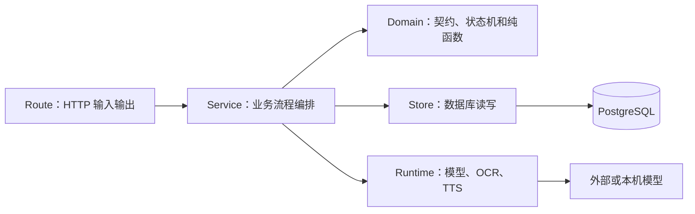
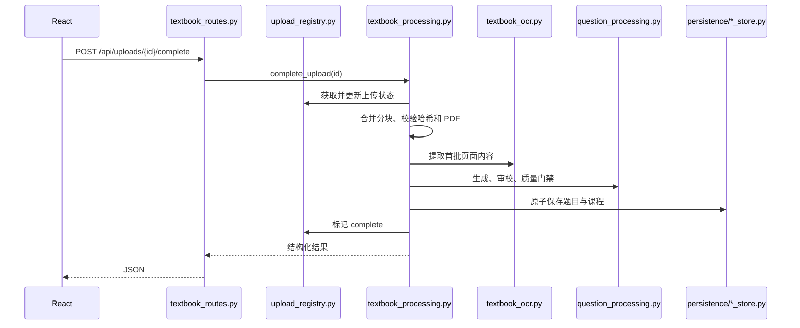

# 后端架构学习指南

本文面向希望通过 Dotty Tutor 学习 FastAPI、模块化单体、SQLAlchemy 和 AI 应用编排的开发者。
阅读目标不是记住所有文件，而是建立一张稳定的“请求从哪里进入、规则在哪里执行、数据在哪里保存”地图。

## 1. 先建立四层心智模型

后端采用模块化单体，不使用微服务。一次请求通常按下面方向流动：



各层只解决一种问题：

| 层 | 应该包含 | 不应该包含 |
| --- | --- | --- |
| Route | 参数校验、状态码、文件响应、调用服务 | SQL、长流程、提示词 |
| Service | 多步骤流程、状态推进、失败恢复 | FastAPI 应用注册 |
| Domain | Pydantic 契约、判题、状态转换、纯函数 | 数据库连接和 HTTP |
| Store | SQLAlchemy 查询、事务、持久化映射 | OCR、模型调用、页面响应 |
| Runtime | 外部能力选择、调用、超时和回退 | 教材或错题业务状态 |

判断代码放哪里时，可以问一句：如果明天把 HTTP 改成后台 Worker，这段代码还能原样使用吗？如果不能，
它大概率仍混入了 Route 职责。

## 2. 从组合根开始读

`backend/app.py` 是组合根。它创建共享对象并注册路由，不负责业务实现。建议第一次阅读只确认三件事：

1. FastAPI 应用从哪里创建。
2. 哪些路由被注册。
3. 数据库引擎、模型 Runtime 和 Store 如何共享。

不要从最长文件开始读，也不要沿着所有 import 展开。先选择一条用户路径。

## 3. 教材 PDF 请求是怎样流动的

完成分块上传时，调用链如下：



这里有三个刻意保留的边界：

- `textbook_routes.py` 只理解 HTTP 和文件传输。
- `textbook_processing.py` 理解“完成教材处理”的步骤顺序。
- `question_processing.py` 只处理一组已提取题目，因此未来可被 Worker 直接复用。

当前服务仍在 HTTP 请求内同步执行。将来如果真实 PDF 处理时间影响部署，只需要让 Route 入队，并让 Worker
调用 `TextbookProcessingService.complete_upload()` 或 `process_batch()`；无需复制 OCR 和生成逻辑。

## 4. 为什么 Store 要按领域拆分

`backend/persistence/base.py` 只管理共享基础设施：

- 创建 SQLAlchemy Engine。
- 初始化 Schema。
- PostgreSQL/SQLite 通用 Upsert。
- 健康检查和连接关闭。

具体查询放在领域 Store：

- `textbook_store.py`：上传任务、教材库和题目批次。
- `learning_store.py`：课程文档、学习会话、作答和掌握度。
- `mistake_store.py`：错题条目和原图。
- `tutoring_store.py`：多轮线程和消息。

`storage.py` 是兼容门面。旧测试和迁移脚本可以继续使用 `TutorStore`，新代码应依赖更窄的 Store。这样一个
模块的修改不会让无关功能同时承担回归风险。

## 5. 如何理解 AI Runtime

模型相关代码分成“业务要求”和“供应商调用”两部分：

- `question_contracts.py` 定义模型必须返回什么。
- `question_pipeline.py` 做确定性规范化和质量门禁。
- `model_runtime.py` 决定调用 Mock、Codex CLI 或 Ollama。
- `review_runtime.py` 执行第二次文字/视觉复核。
- `ocr_runtime.py` 选择 MinerU 或回退路径。

重要原则是：模型输出永远不是最终事实。它必须先经过 Pydantic/JSON Schema、确定性修复和质量检查，才能
进入数据库和前端。

生成模型与文字审核模型刻意独立选择：低成本模型可以负责初稿，更强模型负责发现结构、公式与语义冲突；
视觉审核继续接收来源页图片，不能被纯文本审核替代。`question_processing.py` 对失败题只进行有上限的局部重试，
仍无法恢复的题进入隔离诊断，避免一题永久阻塞整份试卷，又避免静默发布错误内容。

互动试卷发布采用不可变版本。`publication_revision.py` 从原 PDF 创建完整新版本并送回审核，旧发布版本、学习
会话与作答记录保持可追溯。写入顺序要求“先保存新课程，再创建版本关系，最后切换当前版本”；任何一步失败
都不能让学生入口指向半成品。

## 6. 错题多轮陪练怎样保持上下文

错题链路适合学习“状态机比无限聊天更可靠”：

```text
mistake_routes.py      录入与确认错题
stateful_tutor.py      diagnose → explain → practice → verify
tutoring_routes.py     HTTP 边界
tutoring_store.py      线程、摘要和有限消息历史
```

每轮不会把全部历史重新发送给模型，而是携带状态摘要和最近必要消息。这样成本、延迟和模型偏移都更可控。

### 6.1 掌握证据和复习调度为什么分开

阶段四使用三类 Store，各自只有一个变化原因：

- `VariationStore` 保存首次掌握验证题，并从不可变作答记录推导连续正确次数。
- `MistakeStore` 只执行 `unmastered → mastered` 业务状态转换。
- `ReviewStore` 幂等创建第 1、3、7 天任务，并保存每项复习题和最终作答。

这种拆分避免用聊天消息判断掌握，也避免把“连续正确计数”保存成可能与真实答案不一致的第二份状态。
`ReviewStore.schedule()` 依靠 `(mistake_id, interval_days)` 唯一约束保证重试安全；Route 负责依次编排
“判题—迁移—排期”，模型仍然不能直接修改掌握状态。

## 7. 测试应该保护什么

本项目的测试分三层：

1. 纯函数/契约测试：判题、Schema 和规范化。
2. Store/Route 测试：使用临时 SQLite 和 FastAPI TestClient。
3. Playwright E2E：保护学生能看到并操作的主路径。

常用命令：

```bash
MODEL_PROVIDER=mock REVIEW_PROVIDER=mock VISION_PROVIDER=mock \
  .venv/bin/python -m unittest discover -s backend -p 'test_*.py'

cd frontend
npm ci
npm run build
npm run test:e2e
```

重构时先保持行为测试不变。如果依赖边界移动，例如 Route 把工作委托给 Service，Mock 应改为 patch 新的实际
调用位置；不要为了让测试通过而把业务重新导回 Route。

## 8. 本项目的注释约定

有价值的注释解释“为什么”：

- 为什么保留兼容门面。
- 为什么状态只允许某种转换。
- 为什么需要事务或去重。
- 为什么模型结果还需要确定性门禁。

不建议给 `filename = Path(...).name` 这类代码写“获取文件名”的逐行注释。函数名、类型和 Docstring 应先让
代码自解释，注释只补充无法从语法看出的设计约束。

## 9. 推荐学习练习

按风险从低到高完成：

1. 给 `TextbookStore` 增加一个只读统计方法和测试。
2. 给教材上传增加一种明确的失败状态，并观察前端轮询。
3. 为 `question_pipeline.py` 新增一种题型的纯函数规范化。
4. 给 `StatefulTutor` 增加一个不会改变数据库结构的提示策略。
5. 用一个内存队列模拟 Worker，调用 `TextbookProcessingService`，但不修改 Service 本身。

每个练习都应先写一个失败测试，再完成实现，最后更新对应文档和 CHANGELOG（仅用户可感知的改动）。

## 10. 常见误区

- 不要仅因为文件超过某个行数就拆类；按“变化原因”拆分。
- 不要让 Store 调用模型，也不要让 Runtime 写业务表。
- 不要让 `app.py` 成为全局工具箱；它只能是组合根。
- 不要为了未来可能的微服务提前引入消息队列、Repository 接口和依赖注入框架。
- 不要把真实教材、学生数据、模型权重或 `.env` 提交到仓库。

继续阅读可参考[系统架构](architecture.md)、[代码结构指南](codebase-guide.md)和
[本地开发指南](development.md)。
