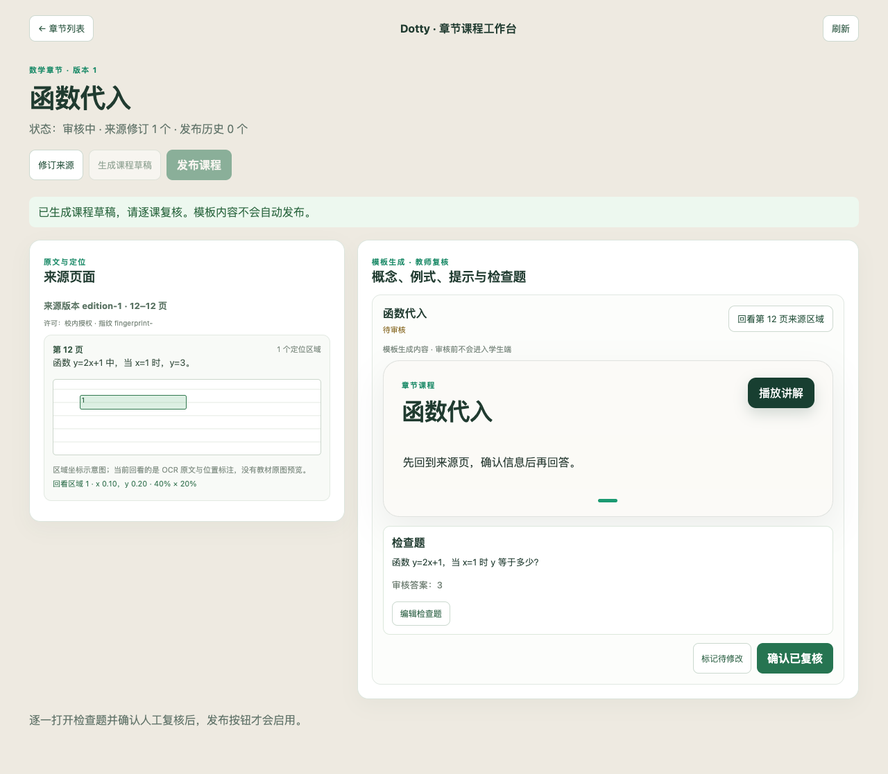
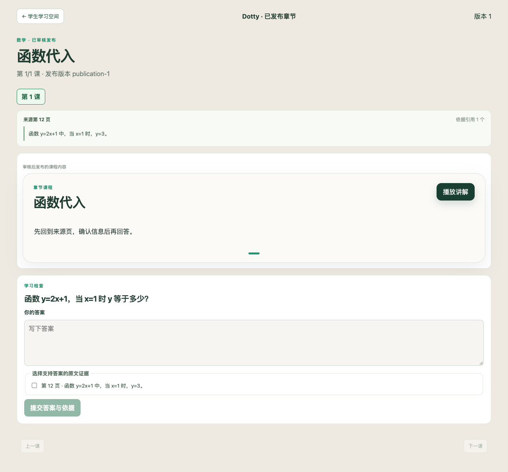

# 数学章节与英语阅读验收记录

日期：2026-10-03。范围由用户确认：连续推进路线图 A/B（批次 1～4），Luna 实现、主代理独立审查和复跑。计划见 [实施及验收计划](chapter-ab-implementation-plan.md)。批次 1～4 的工程第一版本地验收已通过；后续 PR CI 与合并结果在交付时独立核对。

## 数据与运行边界

本次使用原创合成场景，没有指定真实教材或真实参与者。基线候选全部为 `synthetic`、`pending_human_review`、`counted=false`；不会计入人工金标准。测试使用专用临时 PostgreSQL 集群与一次性数据库，不使用应用库。模型/OCR质量与真实学习效果未验证。生成器仅提供按页的有限关系式/地点题模板；词义、指代、推断及更完整讲解通过教师编辑与明确复核构建。来源回看包含 OCR 页文本及区域坐标示意，未实现原 PDF 页或扫描图背景的区域预览。

## 独立检查结果

| 检查 | 当前结果 |
| --- | --- |
| 章节场景 CLI `--check` | 通过；12 数学、6 英语候选，4 个数学生产切分已知失败和 1 个英语预期拒绝单列 |
| `tests.test_chapter_baseline` | 10 个行为测试通过 |
| `tests.test_chapter_english_evaluation` | 17 个行为测试通过 |
| 完整后端门禁 | ruff 通过、pyright 0 错误；683 个 unittest 全部通过，无数据库跳过 |
| 完整前端门禁与 E2E | lint、API 漂移、tsc、build 通过；32 文件/118 个 Vitest 测试和 19 个 Playwright 流程通过 |
| PostgreSQL 章节闭环与历史验收 | 11 个专用闭环、并发、历史与幂等场景通过；包含于后端全量测试 |
| PostgreSQL + protected 身份与教师复核 | 2 个验收场景通过；教师安全预览、学生身份归属及角色限制已复跑 |
| PostgreSQL 发布事务及旧入口保护 | 2 个验收场景通过；最终写入失败整体回滚，重试无孤儿发布，旧入口不能创建或读取章节课程 |
| 新工作台与学生页截图 | 已查看最终截图；状态中文文案、学科入口与来源坐标示意已验收 |

## 审查发现及修复验证

首轮真实数据库与代码审查发现并退回修复的阻断项：

| 问题 | 验收要求 |
| --- | --- |
| 发布安全投影引用未定义变量 | 实际发布响应成功，重新创建 Store 后可读 |
| 数学首次反馈与持久化判定不一致 | 判题输入适配现有协议，首提、刷新及重放均读取同一服务端判定 |
| 来源修订使用精简课程摘要写库，缺少标题 | 修订读取完整课程后更新状态，历史发布不变 |
| 英语课程可经数学会话入口创建 session | 学科标识始终持久化，旧路径拒绝且不产生数学掌握度 |
| 教师无法通过学生专用恢复接口查询提交 | 独立教师查询接口及 protected 角色验收 |
| 学生固定 demo 身份与跨账号缓存 | 身份由现有会话派生，本地恢复按学习者和发布版本隔离 |
| 多次写入后才检查章节版本冲突 | 来源、课程及发布在同一事务内完成，冲突整体回滚 |
| 陈旧页面可批准已修改内容 | 审核携带章节版本前提，不匹配时要求刷新重审 |

以下业务边界已通过专用 PostgreSQL 和权限验收逐项确认：

- 课程来源与审核记录落库，重新创建 Store 后仍可恢复。
- 学生视图只含已发布内容，不泄露标准答案、评分 rubric 或内部审核诊断。
- 编辑已审核题目和来源修订要求重新审核，历史发布与作答保持可读。
- 发布、生成和作答重试幂等；相同 `attemptId` 的身份、题目或请求变化产生冲突。
- 数学确判写现有学习证据；未判定提交仍可恢复但不写掌握度。
- 英语依据检查绑定来源版本、页、句/区域；答对但依据错保持待复核。
- 简答合理改写未匹配已审核变体时待复核，教师确认追加证据，不覆盖原始判定。
- 英语不能经旧数学入口绕过依据判定，也不进入数学掌握度。
- 作答身份与受保护会话一致；学生不能读取他人的提交或访问教师编辑/审核接口。

## 实际执行的门禁

后端：

```bash
cd apps/api
uv run ruff check .
uv run pyright
uv run python -m unittest discover -s tests -p 'test_*.py'
uv run python -m unittest tests.test_chapter_postgres_acceptance tests.test_chapter_auth_acceptance tests.test_chapter_transaction_acceptance -v
uv run python -m evaluation.chapter.baseline --check --json --output /tmp/chapter-baseline-report.json
```

全量 unittest 命令由任务专用启动包装器提供已经迁移的临时 runtime 数据库；`DOTTY_TEST_POSTGRES_ADMIN_URL` 指向专用临时 PostgreSQL，各数据库测试仍创建并清理自己的隔离库。初轮全量暴露旧接口重试兼容问题，修复后 683 个全部通过；没有连接应用数据库。

前端：

```bash
cd apps/web
pnpm lint
pnpm vitest run
pnpm check:api
pnpm exec tsc --noEmit
pnpm run build
DOTTY_WEB_PORT=59203 pnpm run test:e2e
```

根目录 `python3 scripts/check_test_discipline.py` 通过（88 个后端测试文件，无未登记 mock/sleep）；`git diff --check` 通过。Docker 本地命令未执行，因为本次没有修改 Docker 文件；PR 的既有 Docker CI 仍保留为合并门禁。浏览器 E2E 使用 API fixture；真实持久化、来源历史、角色与判定契约由后端专用 PostgreSQL 验收覆盖。没有执行真实 OCR/模型质量或学习效果试验。

补充兼容性修复：章节提交遇到不同内容的相同 `attemptId` 返回冲突；既有普通数学重试继续保留首次服务端判定，不覆盖学习证据。旧 publication 读取入口拒绝章节课程，要求使用安全的章节投影。

## 尚需真实验证

授权教材的人工复核、真实 OCR 与模型生成质量、50+ 独立双审人工金标准、跨模型统计结论，以及迁移题和延迟复测的学习收益不由本次合成工程验收证明。

## 界面验收截图

以下为浏览器测试中的原创合成 fixture，教师工作台与学生阅读页已逐张查看；不是教材质量或真实用户试验的证据。




