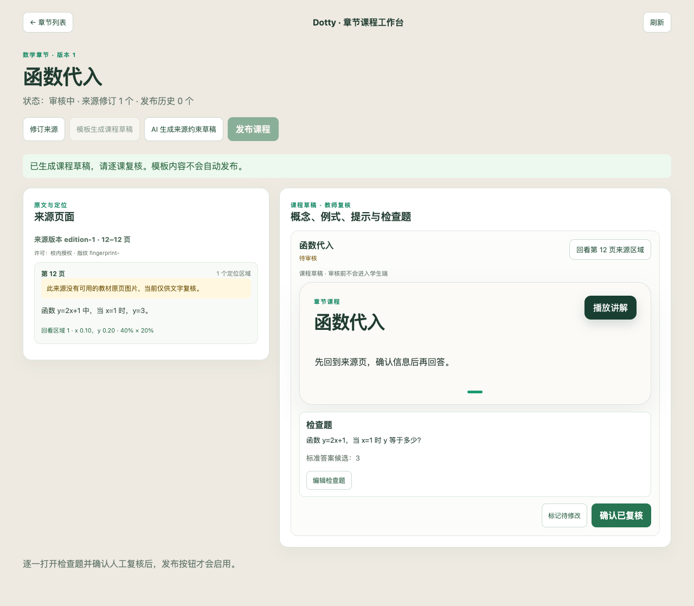

# 章节原页预览、AI 草稿与真实来源复核包验收

日期：2026-10-03。接续“检查最新路线图任务”的第 1～3 项增强，旧工作区改动恢复到独立工作区后验收。
这份记录对应本轮工程增强，不替代 [第一版验收记录](chapter-ab-acceptance-report.md)。
提交、CI 与合并状态以交付 PR 为准；工程验收不表示已完成线上部署或真实教材人工质量验收。

## 完成范围与剩余验收

| 项目 | 本轮完成 | 仍需验证 |
| --- | --- | --- |
| 真实教材验收准备 | 12 个开放数学页场景、6 个英语阅读场景；来源、许可、哈希、页码、预期与实际、待复核状态；人工决策导入 | 18 个案例均待真实人工复核，双审金标准为 0；未执行真实 OCR 或模型质量评测 |
| 原页与图表回看 | 固定来源修订的原 PDF 页 PNG、归一化区域叠加、放大、缺失/加载失败提示；教师权限、文件替换和缓存路径边界 | 真实扫描 OCR、自动区域识别及图文归属质量仍需评测；坐标必须来自现有来源元数据 |
| 数学与英语内容能力 | 数学概念、条件、例题、三级提示、检查题的来源约束 AI 草稿；四类英语题、建议变体/rubric；异步进度、刷新恢复、取消及手动重试 | 定位校验不证明讲解/答案语义正确；真实生成质量需教师复核，未知合理改写保持待审 |

教材 PDF 保存在仓库外。机器准备与代理查看页面都不能冒充人工审核；案例仍为
`real_open_material`、`pending_human_review`、`counted=false`，不写入双审人工金标准。
本轮没有实施视频和实时语音，也没有验证真实学习收益。

## 修复及可观察验收

- 草稿生成失败只消耗一次执行预算，教师明确重试后保持原 `jobId`、审计次数与单份课程结果。
  旧日志中的 `queued`/`failed` 失败发生在单次执行策略完成之前；恢复后的真实数据库复跑已通过。
- 来源或记录版本在模型调用期间变化时，旧结果不得覆盖新修订或教师审核。
- 取消生成后不留可发布的新草稿；未经教师批准无法发布，学生投影不含检查题答案或内部 rubric。
- 教师修改数字答案后可正常审核；修改题干和三级提示后，发布课程块与服务端判题内容保持一致。
  新增场景先出现 `409` 审核失败，再修复并复跑通过。
- 英语跨页阅读原文不能被概念编辑覆盖。新增场景先复现两页变成同一段文字，再修复并复跑通过。
  前端按章节学科保留原文，不提供原文覆盖编辑，答案变体仍需教师逐项确认。
- 原页预览忽略客户端预览路径，校验上传目录、页范围与原文件 SHA-256；文件替换返回冲突。
  缓存目录被符号链接引出上传目录时先拒绝，避免写出上传边界；新增场景先复现错误后修复。
- PDF 小数点不被误切成句子，软换行与句末引号仍保留在可逐字引用的原文中。
- 长原文页面点击区域时优先滚动到原图区域，而不是图片下方的文字按钮；真实页面检查发现后，
  浏览器场景等待滚动稳定并验证原图区域仍在视口，先复现失败再修复。

## 真实来源与当前基线

使用下载版本 PDF 第 4 页的版权信息，而非用网站当前许可替代文件版本许可：

| 来源 | 版本与许可 | PDF 页码 | 文件 SHA-256 |
| --- | --- | --- | --- |
| [OpenStax Elementary Algebra 2e](https://assets.openstax.org/oscms-prodcms/media/documents/ElementaryAlgebra2e-WEB_EjIP4sI.pdf) | 2020 版权 PDF，2026-10-03 下载；CC BY 4.0 | 214～225，12 个数学场景 | `08553ad4ccb04afc145d8c17a0a7fdc0420e7501ac679793c19ce19e7c680805` |
| [OpenStax Writing Guide with Handbook](https://assets.openstax.org/oscms-prodcms/media/documents/WritingGuide-WEB.pdf) | 2026 版权 PDF，2026-10-03 下载；CC BY-NC-SA 4.0，本轮非商业评测 | 123，6 个英语场景 | `86ef566965110032b651122c8e466a607157613302a5a283bd1f221727e590ab` |

署名：Access for free at openstax.org。PDF 页序与印刷页码不同：数学 PDF 214 页对应印刷 206 页，
英语 PDF 123 页对应印刷 109 页；API、定位与复核包使用 PDF 页序，不混用页码。

数学：12/12 引用片段在指定页文本层存在；12/12 提议题号与现有 `split_question_sources` 结果不匹配。
现有切分器未正确支持 OpenStax 的 `EXAMPLE 2.2`、`TRY IT` 与该页练习版式，不能把片段存在报告为抽题成功。
这些失败保留在待复核包，不通过修改预期消除。当前真实材料只使用文本层，没有扫描 OCR 执行、
缺页/条件遗漏或图文归属的真实识别质量结论；相应拒绝行为由独立工程测试覆盖。

英语：词义、指代、明示信息和提议推断的生产判定器重放为 `correct/supported`；
合理改写为 `needs_review/supported`，答对但依据错误为 `needs_review/mismatch`。
这是以尚待人工校准的答案及 rubric 进行的契约重放，不能作为语义准确率或推断正确性的实测结果。

复核包位于 `/private/tmp/dotty-dcaa-real-review/`：`manifest.json`、`cases.jsonl`、`review-packet.md`。
外部输入及 PDF 位于 `/private/tmp/dotty-chapter-real-v2/`，临时目录可能被系统清理；使用前先核对材料哈希。
若材料缺失，应重新取得授权的相同版本并重建来源包，不能沿用失效路径或旧哈希。

## 实际执行的验证

后端在 `apps/api` 执行：

```bash
uv run ruff check .
uv run pyright
uv run python -m unittest discover -s tests -p 'test_*.py'
uv run python -m unittest tests.test_chapter_quality_postgres tests.test_chapter_source_preview -v
uv run python -m evaluation.chapter.real_sources prepare \
  --source-pack /private/tmp/dotty-chapter-real-v2/source-pack.json \
  --out-dir /private/tmp/dotty-dcaa-real-review
```

Ruff 通过，Pyright 0 错误；712 项全量 unittest 通过，数据库场景没有因缺少 admin URL 跳过。
全量命令由任务专用临时包装器执行，先创建并迁移一次性 runtime 库，再启动上述原命令；
数据库测试另外创建自己的隔离库。admin 仅指向任务临时 PostgreSQL 59231 端口，不使用应用或生产数据库。
保留日志出现部分既有 psycopg 连接 ResourceWarning，不把警告描述为零警告。
Pyright 另有根目录 venv 路径提示，但通过 `uv run` 在 `apps/api/.venv` 执行。

前端在 `apps/web` 执行：

```bash
pnpm lint
pnpm vitest run
pnpm check:api
pnpm exec tsc --noEmit
pnpm run build
DOTTY_WEB_PORT=59232 pnpm run test:e2e
```

lint、API 类型漂移、TypeScript、build 通过，33 文件/129 项 Vitest 通过；20 项 Playwright 流程通过。
学科信息编辑保护补齐后已复跑全部浏览器流程；新编辑断言另有定向 Vitest 复跑。
浏览器测试使用固定 API 数据；真实持久化与 Worker、权限、安全投影由后端 PostgreSQL 验收覆盖。
未拦截的非场景模型配置请求产生本机 8010 连接提示，不是完整部署或真实模型调用验收。

根目录 `python3 scripts/check_test_discipline.py` 通过（93 个测试文件，无未登记 mock/sleep）；
`git diff --check` 通过。没有改 Docker 配置，未执行 Docker 构建/启动；未执行线上迁移或部署。

PDF 技能使用 Poppler 渲染并查看真实数学 214 页和英语 123 页；原页文字、公式及段落可读。
Playwright 真实页面布局检查使用原教材渲染图片与人工选定区域作为明确的 UI 测试数据，
检查叠加与放大布局；不证明 OCR 自动区域定位正确，也不写入人工审核记录。

## 后续验收

1. 真实复核者逐案检查题号、公式/条件、答案、原页位置与英语依据，按复核包格式导入决定。
2. 单独修复并评测 OpenStax 例题/练习版式的切分，不静默将当前失败归为成功。
3. 使用真实模型与扫描材料做有界质量试验，记录拒绝、误判、人工分歧、耗时与成本。
4. 满足独立双审协议后再建立 50+ 人工金标准；真实学习收益仍需参与者迁移题及延迟复测。

## 工作台截图

下图使用合成章节数据，展示来源约束 AI 草稿入口、教师审核与原页缺失提示，不含教材或学生数据。


