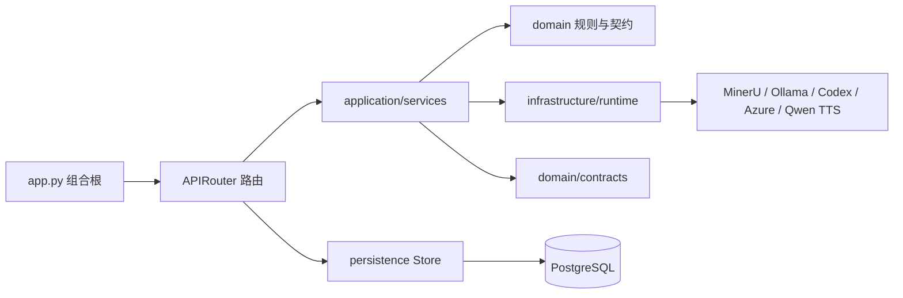
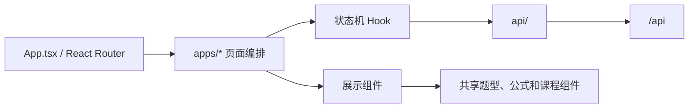

# 代码结构、复用决策与扩展指南

本文面向第一次阅读或继续维护 Dotty Tutor 的开发者，回答四个问题：代码放在哪里、一次请求如何流动、
哪些能力直接复用开源实现，以及新增功能时应在哪个边界修改。

## 设计目标

Dotty Tutor 是个人技术 Demo，不追求微服务数量或企业框架完整度。架构选择按以下顺序判断：

1. 演示路径是否稳定、可解释。
2. 一名维护者能否在十分钟内找到相关代码。
3. 相同能力是否已有成熟依赖或仓库内实现。
4. 模型、OCR、数据库或浏览器能否被 Mock 后独立测试。
5. 只有真实出现第二种实现时，才增加新的抽象层。

因此，本项目采用模块化单体：一个 React 前端、一个 FastAPI 后端、一个 PostgreSQL 数据库，
可选模型/OCR/TTS 通过适配器连接。内容生产、学生学习和错题陪练共享基础设施，但保持页面职责与业务
数据边界清晰。

## 顶层目录

```text
dotty-tutor/
├── package.json                # pnpm 工作区根清单（packageManager 固定 pnpm 版本）
├── pnpm-workspace.yaml         # 工作区声明：当前仅 apps/web
├── pnpm-lock.yaml              # JS 依赖精确锁
├── pyrightconfig.json          # Python 静态类型基线配置（basic，CI 已接门禁）
├── apps/
│   ├── api/                    # FastAPI、领域编排、适配器和测试
│   │   ├── pyproject.toml      # 依赖唯一来源与工具配置（ruff/pyright）
│   │   ├── uv.lock             # Python 依赖精确锁（uv sync --frozen）
│   │   ├── Dockerfile          # API/Worker 镜像
│   │   ├── app.py              # ASGI 组合根；只装配，不写业务逻辑
│   │   ├── app_factory.py      # 中间件、安全头、CORS、请求日志
│   │   ├── routers/            # HTTP 协议边界；按产品域拆分 APIRouter
│   │   │   ├── textbook_routes.py # 教材 HTTP、分块接收和文件响应
│   │   │   ├── tutoring_routes.py # 错题陪练线程 API
│   │   │   └── ...             # 学习、发布、运行时和错题路由
│   │   ├── application/services/ # 可由 HTTP 或 Worker 调用的业务编排
│   │   │   ├── textbook_processing.py # PDF 合并、OCR、生成和批次编排
│   │   │   ├── question_processing.py # 批次生成、审校和质量门禁
│   │   │   ├── personalized_assignment.py # 全班共享个性化作业生成与幂等 publication
│   │   │   ├── stateful_tutor.py # 有状态陪练编排
│   │   │   └── learning_funnel.py # 学习效果漏斗聚合（GET /api/funnel）
│   │   ├── textbook_ocr_pipeline.py # 页面级 OCR 路由、局部升级和缓存编排
│   │   ├── ocr_pipeline.py     # 页面探测、路由和内容寻址缓存纯函数
│   │   ├── ocr_quality.py      # 页面/题块质量门禁和有限重试策略
│   │   ├── ocr_preflight.py    # 正式 OCR 前的页面预检分类和脏页摘要
│   │   ├── textbook_ocr.py     # 手工文本/MinerU/pypdf 的回退策略
│   │   ├── domain/             # 跨业务域契约、题目、学习和陪练规则
│   │   │   ├── contracts/      # 稳定请求/响应契约
│   │   │   ├── questions/      # 题目来源、Schema 和质量纯函数
│   │   │   ├── learning/       # 知识点身份和 mastery-v2 派生算法
│   │   │   ├── tutoring/       # 判题、陪练策略和状态机纯函数
│   │   │   └── assignment_planning.py # 跨 publication 聚合、错因统计和目标排序
│   │   ├── mistake_recognition.py # 复用教材流水线的错题识别适配
│   │   ├── variation_service.py # 错题变式验证题生成、归因采信和题型门禁
│   │   ├── answer_evaluator.py # 结构化题型与多小问的确定性答案判定
│   │   ├── publication_revision.py # 不可变试卷新版编排
│   │   ├── run_audit.py        # 运行快照与题目修订审计
│   │   ├── worker.py            # 独立后台 Worker 入口（PostgreSQL Job Store）
│   │   ├── infrastructure/     # Runtime、文件和外部 Provider 适配器
│   │   │   ├── runtime/        # 模型、OCR、审校和 TTS Provider
│   │   │   └── files/          # 上传注册和文件边界
│   │   ├── evaluation/         # 脱敏语料、Badcase、重放和 Judge 工具
│   │   └── persistence/        # 数据库基础设施和按领域拆分的 Store
│   │       ├── base.py         # 引擎、初始化、健康检查和通用 Upsert
│   │       ├── schema_registry.py # 各领域 metadata 注册、重复表名检查和 SQLite 初始化
│   │       ├── migration_support.py # Alembic revision 共用的幂等升级与 readiness 报告
│   │       ├── migration_cli.py # current/head/preflight/upgrade/verify 统一命令
│   │       ├── textbook_store.py # 教材导入、题目批次和教材库
│   │       ├── learning_store.py # 课程、学习会话、作答和掌握度
│   │       ├── classroom_store.py # 班级、成员、作业指派、教师复核和看板聚合
│   │       ├── assignment_planning_store.py # 脱敏计划、最终个性化 plan 与确认事务
│   │       ├── metrics_store.py # 模型调用追加指标与报告级聚合
│   │       └── schema.py        # 教材/学习领域表声明
│   │   ├── alembic.ini          # Alembic 配置；连接串来自环境变量
│   │   └── migrations/           # 唯一正式 schema migration 版本链
│   │       ├── env.py            # registry target metadata、事务和 PostgreSQL advisory lock
│   │       └── versions/         # adoption、mastery、assignment、review/variation、错因归因
│   ├── web/                    # React 前端与 Playwright 用户路径
│   │   ├── src/
│   │   │   ├── App.tsx         # React Router 顶层路由和懒加载
│   │   │   ├── apps/home/      # 角色入口选择
│   │   │   ├── apps/student/   # 学生学习空间，不包含生产配置
│   │   │   ├── apps/teacher/   # 班级、作业计划审阅、指派和教师掌握度看板
│   │   │   ├── apps/textbook/  # 内容生产、互动预览与发布子模块
│   │   │   ├── apps/mistake/   # 错题本、录入、确认和陪练
│   │   │   ├── apps/metrics/   # 学习效果与模型成本联合报告
│   │   │   ├── components/     # 跨教材题型复用的作答组件与富文本渲染
│   │   │   ├── answerAssembly.ts # 多小问及画线等交互答案的统一组装
│   │   │   ├── richTextParser.ts # 普通文本与显式数学片段的安全分词
│   │   │   ├── lesson/         # 课程文档和内容块渲染器
│   │   │   ├── api/            # 按产品域拆分的 API
│   │   │   └── types/          # 按领域拆分的稳定类型
│   │   ├── Dockerfile          # Web 构建镜像（corepack 固定 pnpm 版本）
│   │   └── e2e/                # Playwright 用户路径
├── scripts/migrate_mastery_v2.py # deprecated：兼容旧调用，委托 Alembic 支持模块
├── scripts/migrate_class_assignments.py # deprecated：兼容旧调用
├── scripts/migrate_assignment_plans.py # deprecated：兼容旧调用
├── scripts/migrate_teacher_review_events.py # deprecated：兼容旧调用
├── scripts/migrate_variation_attribution.py # deprecated：兼容旧调用
├── scripts/seed_classroom_demo.py # 显式创建班级看板演示数据，不在启动时自动运行
├── docs/                       # 面向维护者和使用者的文档
└── compose.yaml                # 可重复演示环境
```

前端 API 和类型按领域分别位于 `apps/web/src/api/` 与 `apps/web/src/types/` 目录。后端规范代码必须进入
`apps/api/routers`、`apps/api/application/services`、`apps/api/domain`、`apps/api/infrastructure` 或
`apps/api/persistence`；跨领域组合只在明确的应用入口完成。

### P0～P3 后端分层边界

本轮已完成一次可回滚的模块化单体分层：

| 优先级 | 范围 | 验收标准 |
| --- | --- | --- |
| P0 | `apps/api/routers`、`apps/api/application/services`、`apps/api/domain/*`、`apps/api/infrastructure/*`、`apps/api/persistence/` 包边界 | `app.py` 只装配；规范新代码不依赖旧根路径 |
| P1 | 路由与协议层 | 路由只做 HTTP 校验、依赖注入和响应映射，长流程委托 Service |
| P2 | 应用服务与领域规则 | 题目、陪练、教材处理可脱离 FastAPI 复用和单元测试 |
| P3 | Runtime、文件和 Store 基础设施 | 外部 Provider、文件系统和数据库边界可替换，当前入口清晰可测试 |

后端根目录仅保留真实的 ASGI、Worker、OCR 编排和领域服务入口；模块导入必须使用规范包路径。

如果希望按完整用户路径学习前端状态归属、可恢复上传、题型复用和 TTS 竞态处理，参见
[前端架构学习指南](frontend-learning-guide.md)。

## 后端依赖方向



依赖只能向右。Runtime、Store 和领域函数不得导入 `app.py`，否则会产生循环依赖并让单元测试必须启动
整个 Web 应用。

### 本机与 Docker 的 Runtime 边界

运行时下拉框展示的是后端进程的能力，不是浏览器本身的能力。开发脚本会优先探测仓库根目录
`.mineru-venv/bin/mineru`；因此本机后端（`8010`）能选择 MinerU 时，浏览器应使用
`scripts/dev-local.sh` 启动的 API。Docker API 运行在 Linux 容器中，不能执行宿主机 macOS
虚拟环境，也不会自动继承宿主机安装的模型。容器没有 Linux MinerU 或独立 OCR 服务时，
`/api/ocr` 必须把 MinerU 标记为不可用，前端保留“自动选择”和“PDF 文字层”，避免选择后静默
回退导致用户误以为扫描图已经被识别。若要在 Docker 中启用 MinerU，应新增 Linux OCR 镜像或
独立服务，并在 Runtime 适配器中显式注册其健康检查、版本和资源边界。

### `app.py` 为什么保持很小

`app.py` 是 Uvicorn 的固定入口。它负责：

- 调用 `create_app()`。
- 注册 Runtime、学习、教材和错题路由。
- 将同一个数据库引擎及 OCR/生成函数注入错题域。
- 为旧测试和脚本保留少量导出符号。

上传、模型调用、SQL 或响应拼装都不应重新写入该文件。

### 教材链路

```text
apps/api/routers/textbook_routes.py（HTTP、上传状态）
  → application/services/textbook_processing.py（PDF 合并、首批/后续批次编排）
  → textbook_ocr_pipeline.py（页面探测 → 预检分类 → pypdf/MinerU → 局部升级 → 缓存）
  → ocr_pipeline.py / ocr_preflight.py / ocr_quality.py（无副作用路由、预检与质量决策）
  → domain/questions/source.py（按题号切分 Markdown、图注/坐标归属和审计；
     切分失败且 `looks_like_multi_question_document()` 判定为多题文档时，由调用方报 422，
     不走"整页当作一道题"的兜底）
  → domain/questions/quality.py（导入质量报告：题数、题号、页面和图片归属）
  → application/services/question_processing.py（生成、审校、确定性修复和质量门禁）
  → persistence/textbook_store.py（题目和上传任务）
  → persistence/learning_store.py（生成后的课程文档）
```

`TextbookProcessingService` 和 `question_processing.py` 已把长流程与 APIRouter 分离。Route 只创建
`background_jobs` 并返回 `202`；`application/textbook_jobs.py` 从 payload 调用 `complete_upload()` 或
`process_batch()`。Worker 不复制 OCR、生成、审校和持久化逻辑，也不应按每个 HTTP 端点创建一个类。

`persistence/job_store.py` 只管理任务生命周期、幂等、租约和错误，不管理教材批次；教材领域进度仍由
`upload_registry.py` 与教材 Store 负责。保持这两层分离可以避免一次任务重试篡改教材当前视图。

### 错题链路

```text
apps/api/routers/mistake_routes.py
  → mistake_recognition.py（复用 OCR 与课程生成）
  → persistence/mistake_store.py（独立 mistake_items 表）
  → apps/api/routers/tutoring_routes.py（线程 HTTP 边界）
  → application/services/stateful_tutor.py（判题、提示和状态转换）
  → persistence/tutoring_store.py（线程与消息）
  → persistence/variation_store.py（验证题与追加式 EvaluationEvidence）
  → apps/api/routers/review_routes.py（复习判题与进度 HTTP 边界）
  → persistence/review_store.py（review_tasks 快照、答案与 evaluation_evidence_json）
```

错因双归因沿着同一条链路流动：`mistake_items.error_reason` 是学生自评，陪练模型把带证据的
`misconception.category` 交给 `turn_plan.normalize_misconception()` 复用证据/置信度门禁；
`tutoring_routes.py` 只在门禁通过后写入 `ai_error_reason` 与置信度。`build_tutor_turn_plan()`
按 AI → 学生自评 → `unknown` 兜底选择变式策略，并在变式题快照 `variationAttributionSource` 记录采信来源；
兜底的 `unknown` 只用于策略选择，跳过自评不会写入数据库。陪练在自评完成或跳过后，
由 `attribution.ts` 从线程消息取最后一条可信 AI 归因，并由 `MistakeAttribution.tsx` 与学生自评并列展示；
错题本也复用 `errorReasons.ts` 区分显示两种标签。

错题域不复制 OCR 或题目生成代码。`mistake_recognition.py` 通过函数注入复用教材能力，因此测试时能
直接替换为确定性识别器，也避免导入 ASGI 应用。

### 数据库迁移链路

```text
DATABASE_URL / POSTGRES_*
  → apps/api/persistence/migration_cli.py
  → Alembic env.py（schema_registry 的 6 个 metadata）
  → 0001 adoption
  → 0002 mastery-v2
  → 0003 assignment governance
  → 0004 teacher review + variation provenance
  → 0005 mistake_attributions + legacy column backfill
```

`DatabaseStore` 及各领域 Store 在 PostgreSQL 运行时不执行 DDL；只有显式 Alembic 命令会修改生产
schema，并在 PostgreSQL 事务内持有 advisory lock。隔离 SQLite 测试可以通过 registry 自动创建当前
schema，但不替代生产迁移。旧的 `scripts/migrate_*.py` 仅保留参数兼容，事实来源是版本链和
`migration_support.py`。`mistake_items` 的旧归因列暂时保留，经过观察窗口后才考虑 contract/drop。

## 前端依赖方向



教材导入是参考实现：

- `TextbookImport.tsx` 只负责页面组合。
- `useTextbookImport.ts` 负责多文件队列、每项断点上传、独立轮询、模型切换和错误状态；页面只负责组合列表与右侧结果。
- `fileValidation.ts` 只包含纯校验和常量。
- `RuntimeSettings`、`TextbookLibrary`、`UploadPanel`、`PipelinePanel` 各自负责一个视觉区域。
  其中 `RuntimeSettings` 收在默认折叠的抽屉里：模型与 OCR 属于低频设置，不应把首屏让给它们而把上传挤到下方。
- `PublicationStatusBar` 只渲染发布状态机（草稿→审核中→已发布）和该状态下可用的动作，自身不持有 state；
  发布相关按钮从顶栏移出后，顶栏只保留导航与当前教材/模型标识。

互动试卷沿用相同分层：`TextbookApp.tsx` 组合内容预览，`usePaperPublication.ts` 负责显式发布状态流；
`PublishedPaperApp.tsx` 组合学生作答，`usePublishedLearningSession.ts` 负责刷新恢复、数据库重建后的旧会话
替换、离线批量补传和掌握度投影；`PaperLearningProgress.tsx` 只展示确定性学习证据，
`PaperQuestionProgress.tsx` 是题号与完成态的唯一展示位（顶栏和题目标题不再重复题号）。
答对后不立即切题：先让"回答正确"反馈可见 1.2 秒再自动推进，学生也可以点"继续下一题"跳过等待。
内容生产端使用 `PracticeWorkspace` 展示重新生成、审核和诊断信息，学生端使用
`StudentQuestionWorkspace` 表达作答、求助和反馈；两者只复用无副作用的 `QuestionAnswer` 与课程渲染器。
多小问由 `QuestionAnswer` 按 `subQuestionAnswers` 分小问提交，后端仅对声明为
`deterministic` 的小问自动判分，`tutor` 小问进入陪练但不会进入 mastery。课程、陪练历史和回退消息
统一通过 `RichText` 渲染普通文字与显式 `$...$` 数学片段，避免把普通文本整段送入公式解析器。
这种边界避免为了复用视觉外壳而把作者权限和内部术语带入学生任务流。

学生首页 `/learn` 是一条今日任务队列（班级作业 → 待确认错题 → 今日复习 → 待订正错题），数据由
`useStudentTodayQueue.ts` 并发读取作业指派、已发布练习、错题和复习进度。作业通过
`assignmentId` 打开学习会话，已发布试卷仍保留在队列下方作为自由练习。教师从 `/teacher` 管理本地班级、
成员和作业；`classroom_store.py` 按单次作业聚合学生完成状态和发布版本内知识点分布。

教师布置作业经过 `useAssignmentPlanning.ts` → `POST /api/classes/{classId}/assignment-plans` →
`AssignmentPlanningService` → `domain/assignment_planning.py`。服务只读取班级证据，使用
`normalized_name` 生成临时 `planningTopicKey`，不跨 publication 直接合并知识点 ID；模型若不可用或
输出越界则回退确定性目标。`AssignmentPlanReview` 确认后才调用 assignments API，Planning Store 在同一
事务中校验计划、发布版本、sourceFingerprint 和提醒确认，并以 `assignment_plan_id` 保证重复确认幂等。
选择生成个性化作业时，`createPersonalizedAssignment` 进入 `PersonalizedAssignmentService`，复用同一份脱敏
计划上下文，一次生成全班共享新题；成功后创建不同 publication 和可确认 final plan，失败不产生可指派成功状态。

错因归因不在确认页收集，而在陪练首轮由学生自评（见 `MistakeTutor.tsx`）：确认页的必填项只剩题干，
分类信息收在折叠抽屉里。跳过自评时**不写入任何值**——`unknown`（完全不会）是一种真实的学生自评，
与"没有回答"含义不同，混为一谈会污染 `turn_plan.py` 的出题策略。

学生的非正确作答由 `apps/api/routers/learning_routes.py` 编排写入 `MistakeStore`。稳定错题 ID 使用学生、试卷和题目
共同生成，因此在线提交、离线补传和重复请求都只更新同一条记录；纸质错题仍走 OCR 与人工确认链路。

错题页面新增复杂状态机时也遵循同样边界，不要把 API 请求重新塞回列表或表单组件。

## 开源能力复用清单

| 能力 | 当前复用 | 本项目只负责 | 不应自建 |
| --- | --- | --- | --- |
| SPA 路由 | [React Router](https://reactrouter.com/) | 页面标题、产品路由配置 | `pushState` 监听和动态参数解析 |
| Web API | [FastAPI](https://fastapi.tiangolo.com/)、[Pydantic](https://docs.pydantic.dev/) | 业务契约和依赖装配 | 请求解析、OpenAPI 生成、Schema 校验 |
| 数据访问 | [SQLAlchemy](https://www.sqlalchemy.org/)、[psycopg](https://www.psycopg.org/) | 表结构、查询和领域状态 | 连接池、SQL 转义、PostgreSQL 驱动 |
| PDF 文字层 | [pypdf](https://pypdf.readthedocs.io/) | 页数/字符边界和回退策略 | PDF 文件格式解析器 |
| 扫描 OCR | [MinerU](https://github.com/opendatalab/MinerU) | 子进程适配、产物路径和失败回退 | 版面分析、公式 OCR、图片提取模型 |
| 数学渲染 | [KaTeX](https://katex.org/) | 文本规范化和 React 包装 | LaTeX 排版引擎 |
| 浏览器回归 | [Playwright](https://playwright.dev/) | 关键用户流程和 API Mock | 浏览器控制、Trace、截图录像框架 |
| 语音 | Web Speech、Azure Speech、Qwen3-TTS | Provider 选择、缓存和回退 | 浏览器 TTS 或语音模型训练 |
| 容器编排 | [Docker Compose](https://docs.docker.com/compose/)、[Nginx](https://nginx.org/) | 服务配置和健康检查 | 自定义进程守护与反向代理 |

新增依赖时记录以下信息：官方仓库或文档、许可证、当前维护状态、前端体积或后端运行成本、替换掉的
自维护代码。仅为了少量格式化或一个简单状态值，不引入新依赖。

## 代码拆分判断

出现以下任一信号时检查拆分：

- 页面同时负责 API 请求、状态机和三块以上独立视觉区域。
- 路由函数同时负责协议校验、模型编排、数据库写入和文件操作。
- 同一段解析、错误回退或路径安全逻辑出现第二次。
- 测试必须 Patch ASGI 入口内部变量才能验证纯业务规则。
- 修改一个题型导致无关产品入口一起重新构建或回归。

不要只按行数切文件。拆出的模块必须能用一句话描述责任，并具有较少、稳定的输入输出。

## 注释规范

应写注释的地方：

- Provider 回退顺序及选择理由。
- 文件路径、MIME、大小、缓存等安全边界。
- PDF 分块和恢复状态机的不变量。
- 模型输出被截断、规范化或确定性修复的原因。
- 内存缓存与 PostgreSQL 真相来源的区别。
- 看似多余、但用于处理浏览器或第三方工具边界情况的代码。

不应写注释的地方：

- `setLoading(true)` 上方写“设置加载状态”。
- 为每个 JSX 标签重复中文说明。
- 与代码不一致的阶段计划或历史实现。

Python 公共模块和复杂函数使用 docstring；TypeScript 状态机 Hook、纯校验函数和存在隐含约束的组件
使用 JSDoc。注释变化应和行为变化在同一个提交中完成。

## 常见扩展路径

### 增加一种题型

1. 在 `domain/questions/contracts.py` 和前端 `types/` 扩展稳定契约。
2. 在 `domain/questions/pipeline.py` 添加模型输出规范化和质量检查。
3. 在 `QuestionAnswer.tsx` 或独立题型组件增加输入。
4. 在 `answer_evaluator.py` 添加确定性判题；无法确定性处理时再调用模型。
5. 增加后端单元测试和 Playwright 用户流程。

### 增加一个模型 Provider

1. 在对应 `*_runtime.py` 内增加适配，不修改页面业务组件。
2. 输出现有统一的 provider/model/fallback/error 记录。
3. 配置通过环境变量提供，不把凭据放入 API 或数据库。
4. 为失败、超时和回退增加测试及日志。

### 扩展错题复习任务

阶段四已经提供 `review_tasks`、复习 API、进度页和 1/3/7 天排期；验证作答由 `variation_attempts` 追加保存，复习作答的
确定性判题证据由 `review_tasks.evaluation_evidence_json` 持久化，Evidence API 负责汇总单道错题的解释链。后续扩展时继续遵循同样边界：

1. 在错题域扩展任务契约和表，不复用教材上传任务表。
2. 复用 `QuestionPayload`、确定性判题和掌握度证据，不让模型直接修改状态。
3. 前端在 `apps/mistake/` 下增加页面与 Hook，通过 React Router 注册子路径。
4. 将跨请求的复习状态保存在 PostgreSQL，不依赖进程内字典。

## 测试边界

- 纯函数：直接单元测试，不启动 FastAPI。
- Runtime/Store：使用替身或临时数据库验证边界。
- API：FastAPI `TestClient` 验证协议、状态码和持久化调用。
- 用户路径：Playwright Mock API，验证路由、录入、确认和作答交互。
- Docker：只验证镜像、网络、健康检查和启动配置，不在其中重复所有业务测试。

提交前命令以 `AGENTS.md` 和 `docs/development.md` 为准。

## 30 分钟代码阅读路线

先用 3 分钟阅读 `apps/api/app.py` 和 `apps/web/src/App.tsx`，认识组合根、角色入口与懒加载边界。剩余时间只选
下面一条路径跟踪，避免同时展开所有 import：

| 学习目标 | 建议阅读顺序 | 重点观察 |
| --- | --- | --- |
| PDF 如何变成题目 | `useTextbookImport.ts` → `apps/api/routers/textbook_routes.py` → `application/services/textbook_processing.py` → `application/services/question_processing.py` → `domain/questions/pipeline.py` | 可恢复上传、服务编排、模型输出门禁 |
| 长任务将如何后台化 | `runtime-governance-plan.md` → `infrastructure/files/upload_registry.py` → `persistence/schema.py` → `application/services/textbook_processing.py` | 运行快照、Job Store、租约、幂等与 Worker 边界 |
| 试卷如何安全发布新版 | `usePaperPublication.ts` → `apps/api/routers/publication_routes.py` → `publication_revision.py` → `persistence/learning_store.py` | 显式状态机、不可变版本、事务写入顺序 |
| 学生作答如何离线同步 | `PublishedPaperApp.tsx` → `usePublishedLearningSession.ts` → `apps/api/routers/learning_routes.py` → `persistence/learning_store.py` → `domain/learning/mastery.py` | 服务端按发布题目解析 knowledgePointId、幂等 attemptId、多小问可判性和最新不同题证据掌握度投影 |
| 教师如何生成并指派个性化作业 | `TeacherClassroomApp.tsx` → `useAssignmentPlanning.ts` → `apps/api/routers/classroom_routes.py` → `application/services/assignment_planning.py` → `persistence/assignment_planning_store.py` | 脱敏班级证据、确定性回退、教师审阅、确认式幂等指派 |
| 错题如何多轮陪练 | `useMistakeTutor.ts` → `apps/api/routers/tutoring_routes.py` → `application/services/stateful_tutor.py` → `persistence/tutoring_store.py` | 有限上下文、确定性判题、状态转换权限 |

最后运行对应测试，把一个断言临时改坏再恢复，观察哪条业务约束在保护流程。推荐只跟踪一条请求，不要从最长
文件开始通读整个仓库。

## 已知架构债务

- PDF 完成和批次处理已有独立应用服务，并由 PostgreSQL Job Store 与单 Worker 异步执行；HTTP 只返回
  `202 + jobId`。后续长任务应注册同类 handler，不复制任务领取、续租和重试循环。
- `persistence/app_store.py` 只负责应用需要的教材/学习 Store 组合；错题、陪练和复习仓储继续独立。
- 模型/OCR 的运行时选择是进程级全局状态，不适合多用户公网服务。
- 文件资源仍保存在本地目录，横向扩容前需要对象存储。

这些项目属于生产化边界，不阻塞个人 Demo。产品优先级见[路线图](roadmap.md)，运行快照、事件、后台任务
和离线评测的学习顺序见[AI 运行治理与后台任务演进计划](runtime-governance-plan.md)。
