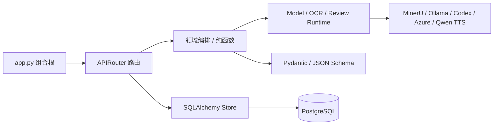
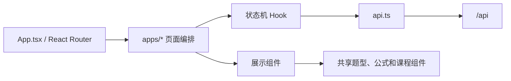

# 代码结构、复用决策与扩展指南

本文面向第一次阅读或继续维护 Dotty Tutor 的开发者，回答四个问题：代码放在哪里、一次请求如何流动、
哪些能力直接复用开源实现，以及新增功能时应在哪个边界修改。

## 设计目标

Dotty Tutor 是个人技术 Demo，不追求微服务数量或企业框架完整度。架构选择按以下顺序判断：

1. 演示路径是否稳定、可解释。
2. 一名维护者能否在十分钟内找到相关代码。
3. 相同能力是否已有成熟依赖或仓库内实现。
4. 模型、OCR、数据库或浏览器能否被 Mock 后独立测试。
5. 只有真实出现第二种实现时，才增加新的抽象层。

因此，本项目采用模块化单体：一个 React 前端、一个 FastAPI 后端、一个 PostgreSQL 数据库，
可选模型/OCR/TTS 通过适配器连接。教材学习和错题陪练共享基础设施，但保持业务路由和数据表分离。

## 顶层目录

```text
dotty-tutor/
├── backend/                    # FastAPI、领域编排、适配器和测试
│   ├── app.py                  # ASGI 组合根；只装配，不写业务逻辑
│   ├── application.py          # 中间件、安全头、CORS、请求日志
│   ├── textbook_routes.py      # 教材 HTTP 工作流和 PDF 状态机
│   ├── question_processing.py  # 可被 HTTP/Worker 复用的批次题目处理
│   ├── library_routes.py       # 教材库读取与软删除
│   ├── textbook_ocr.py         # 手工文本/MinerU/pypdf 的回退策略
│   ├── lesson_generation.py    # 模型生成、规范化和辅导缓存
│   ├── question_source.py      # OCR Markdown 题目切分纯函数
│   ├── question_pipeline.py    # 题目规范化、内容块和质量门禁
│   ├── question_contracts.py   # Pydantic/JSON Schema 和演示种子
│   ├── mistake_*.py            # 错题契约、路由、识别适配和存储
│   ├── tutoring_*.py           # 多轮线程契约、路由和消息存储
│   ├── stateful_tutor.py       # 受约束状态机和有限上下文
│   ├── persistence/            # 数据库基础设施和按领域拆分的 Store
│   │   ├── base.py             # 引擎、初始化、健康检查和通用 Upsert
│   │   ├── textbook_store.py   # 教材导入、题目批次和教材库
│   │   ├── learning_store.py   # 课程、学习会话、作答和掌握度
│   │   └── schema.py           # SQLAlchemy 关系表声明
│   ├── *_runtime.py            # 模型、OCR、审校等外部能力适配器
│   ├── storage.py              # 兼容导出门面；不再承载 SQL 实现
│   └── migrations/             # 可审查的 SQL 迁移
├── frontend/src/
│   ├── App.tsx                 # React Router 顶层路由和懒加载
│   ├── apps/home/              # 双产品入口
│   ├── apps/textbook/          # 教材学习页面与导入子模块
│   │   └── import/             # 导入状态机、校验和展示组件
│   ├── apps/mistake/           # 错题本、录入、裁切和确认
│   ├── components/             # 跨教材题型复用的作答组件
│   ├── lesson/                 # 课程文档和内容块渲染器
│   ├── api/                    # 按教材、错题、辅导和运行时拆分的 API
│   ├── types/                  # 按领域拆分的稳定类型
│   ├── api.ts                  # 兼容导出门面
│   └── types.ts                # 兼容导出门面
├── frontend/e2e/               # Playwright 用户路径
├── docs/                       # 面向维护者和使用者的文档
└── compose.yaml                # 可重复演示环境
```

`api.ts` 和 `types.ts` 只负责统一导出。初学者可以继续从一个门面导入；需要理解某个业务域时，再进入
`api/mistakes.ts`、`api/tutoring.ts` 或对应的 `types/` 文件，调用方不必同步迁移。

## 后端依赖方向



依赖只能向右。Runtime、Store 和领域函数不得导入 `app.py`，否则会产生循环依赖并让单元测试必须启动
整个 Web 应用。

### `app.py` 为什么保持很小

`app.py` 是 Uvicorn 的固定入口。它负责：

- 调用 `create_app()`。
- 注册 Runtime、学习、教材和错题路由。
- 将同一个数据库引擎及 OCR/生成函数注入错题域。
- 为旧测试和脚本保留少量导出符号。

上传、模型调用、SQL 或响应拼装都不应重新写入该文件。

### 教材链路

```text
textbook_routes.py（HTTP、上传状态）
  → textbook_ocr.py（手工文本 → MinerU → pypdf）
  → question_source.py（按题号切分 Markdown）
  → question_processing.py（生成、审校、确定性修复和质量门禁）
  → persistence/textbook_store.py（题目和上传任务）
  → persistence/learning_store.py（生成后的课程文档）
```

`question_processing.py` 已经与 FastAPI 解耦，未来 Worker 可以直接复用。`textbook_routes.py` 目前仍
包含 PDF 合并和按批次处理同步状态机；迁移后台任务时，应以“完成上传任务”和“处理一个批次”为
两个任务函数继续拆出，而不是按每个 HTTP 端点创建一个类。

### 错题链路

```text
mistake_routes.py
  → mistake_recognition.py（复用 OCR 与课程生成）
  → mistake_store.py（独立 mistake_items 表）
  → tutoring_routes.py（线程 HTTP 边界）
  → stateful_tutor.py（判题、提示和状态转换）
  → tutoring_store.py（线程与消息）
```

错题域不复制 OCR 或题目生成代码。`mistake_recognition.py` 通过函数注入复用教材能力，因此测试时能
直接替换为确定性识别器，也避免导入 ASGI 应用。

## 前端依赖方向



教材导入是参考实现：

- `TextbookImport.tsx` 只负责页面组合。
- `useTextbookImport.ts` 负责初始化、断点上传、轮询、模型切换和错误状态。
- `fileValidation.ts` 只包含纯校验和常量。
- `RuntimeSettings`、`TextbookLibrary`、`UploadPanel`、`PipelinePanel` 各自负责一个视觉区域。

错题页面新增复杂状态机时也遵循同样边界，不要把 API 请求重新塞回列表或表单组件。

## 开源能力复用清单

| 能力 | 当前复用 | 本项目只负责 | 不应自建 |
| --- | --- | --- | --- |
| SPA 路由 | [React Router](https://reactrouter.com/) | 页面标题、产品路由配置 | `pushState` 监听和动态参数解析 |
| Web API | [FastAPI](https://fastapi.tiangolo.com/)、[Pydantic](https://docs.pydantic.dev/) | 业务契约和依赖装配 | 请求解析、OpenAPI 生成、Schema 校验 |
| 数据访问 | [SQLAlchemy](https://www.sqlalchemy.org/)、[psycopg](https://www.psycopg.org/) | 表结构、查询和领域状态 | 连接池、SQL 转义、PostgreSQL 驱动 |
| PDF 文字层 | [pypdf](https://pypdf.readthedocs.io/) | 页数/字符边界和回退策略 | PDF 文件格式解析器 |
| 扫描 OCR | [MinerU](https://github.com/opendatalab/MinerU) | 子进程适配、产物路径和失败回退 | 版面分析、公式 OCR、图片提取模型 |
| 数学渲染 | [KaTeX](https://katex.org/) | 文本规范化和 React 包装 | LaTeX 排版引擎 |
| 浏览器回归 | [Playwright](https://playwright.dev/) | 关键用户流程和 API Mock | 浏览器控制、Trace、截图录像框架 |
| 语音 | Web Speech、Azure Speech、Qwen3-TTS | Provider 选择、缓存和回退 | 浏览器 TTS 或语音模型训练 |
| 容器编排 | [Docker Compose](https://docs.docker.com/compose/)、[Nginx](https://nginx.org/) | 服务配置和健康检查 | 自定义进程守护与反向代理 |

新增依赖时记录以下信息：官方仓库或文档、许可证、当前维护状态、前端体积或后端运行成本、替换掉的
自维护代码。仅为了少量格式化或一个简单状态值，不引入新依赖。

## 代码拆分判断

出现以下任一信号时检查拆分：

- 页面同时负责 API 请求、状态机和三块以上独立视觉区域。
- 路由函数同时负责协议校验、模型编排、数据库写入和文件操作。
- 同一段解析、错误回退或路径安全逻辑出现第二次。
- 测试必须 Patch ASGI 入口内部变量才能验证纯业务规则。
- 修改一个题型导致无关产品入口一起重新构建或回归。

不要只按行数切文件。拆出的模块必须能用一句话描述责任，并具有较少、稳定的输入输出。

## 注释规范

应写注释的地方：

- Provider 回退顺序及选择理由。
- 文件路径、MIME、大小、缓存等安全边界。
- PDF 分块和恢复状态机的不变量。
- 模型输出被截断、规范化或确定性修复的原因。
- 内存缓存与 PostgreSQL 真相来源的区别。
- 看似多余、但用于处理浏览器或第三方工具边界情况的代码。

不应写注释的地方：

- `setLoading(true)` 上方写“设置加载状态”。
- 为每个 JSX 标签重复中文说明。
- 与代码不一致的阶段计划或历史实现。

Python 公共模块和复杂函数使用 docstring；TypeScript 状态机 Hook、纯校验函数和存在隐含约束的组件
使用 JSDoc。注释变化应和行为变化在同一个提交中完成。

## 常见扩展路径

### 增加一种题型

1. 在 `question_contracts.py` 和前端 `types.ts` 扩展稳定契约。
2. 在 `question_pipeline.py` 添加模型输出规范化和质量检查。
3. 在 `QuestionAnswer.tsx` 或独立题型组件增加输入。
4. 在 `answer_evaluator.py` 添加确定性判题；无法确定性处理时再调用模型。
5. 增加后端单元测试和 Playwright 用户流程。

### 增加一个模型 Provider

1. 在对应 `*_runtime.py` 内增加适配，不修改页面业务组件。
2. 输出现有统一的 provider/model/fallback/error 记录。
3. 配置通过环境变量提供，不把凭据放入 API 或数据库。
4. 为失败、超时和回退增加测试及日志。

### 增加错题复习任务

1. 在错题域创建任务契约和表，不复用教材上传任务表。
2. 复用 `QuestionPayload`、确定性判题和掌握度计算。
3. 前端在 `apps/mistake/` 下增加页面与 Hook，通过 React Router 注册子路径。
4. 将跨请求的复习状态保存在 PostgreSQL，不依赖进程内字典。

## 测试边界

- 纯函数：直接单元测试，不启动 FastAPI。
- Runtime/Store：使用替身或临时数据库验证边界。
- API：FastAPI `TestClient` 验证协议、状态码和持久化调用。
- 用户路径：Playwright Mock API，验证路由、录入、确认和作答交互。
- Docker：只验证镜像、网络、健康检查和启动配置，不在其中重复所有业务测试。

提交前命令以 `AGENTS.md` 和 `docs/development.md` 为准。

## 30 分钟代码阅读路线

1. 用 3 分钟阅读 `backend/app.py`，认识组合根以及依赖如何注入。
2. 用 3 分钟阅读 `frontend/src/App.tsx`，确认两个产品入口和懒加载边界。
3. 用 6 分钟沿 `MistakeCapture → api/mistakes.ts → mistake_routes.py → mistake_store.py` 跟踪错题录入。
4. 用 8 分钟沿 `MistakeTutor → useMistakeTutor → tutoring_routes.py → stateful_tutor.py` 跟踪一轮陪练。
5. 用 5 分钟对照 `persistence/schema.py`、`mistake_store.py` 和 `tutoring_store.py` 理解数据关系。
6. 用 5 分钟运行 `test_stateful_tutoring.py`，把一个断言改坏再恢复，观察状态机如何被保护。

推荐只跟踪一条请求，不要从最长的 PDF 路由开始通读整个仓库。

## 已知架构债务

- PDF 完成和批次处理仍在 HTTP 请求中同步执行；题目处理已独立，任务调度仍应迁移 Worker。
- `storage.py` 仅为旧调用方提供兼容门面；新代码应直接依赖 `TextbookStore` 或 `LearningStore`，并继续
  保持错题、陪练仓储各自独立。
- `frontend/src/api.ts` 和 `types.ts` 已变为兼容 barrel，领域实现位于对应目录。
- 模型/OCR 的运行时选择是进程级全局状态，不适合多用户公网服务。
- 文件资源仍保存在本地目录，横向扩容前需要对象存储。

这些项目属于生产化边界，不阻塞个人 Demo。路线和优先级见[路线图](roadmap.md)。
