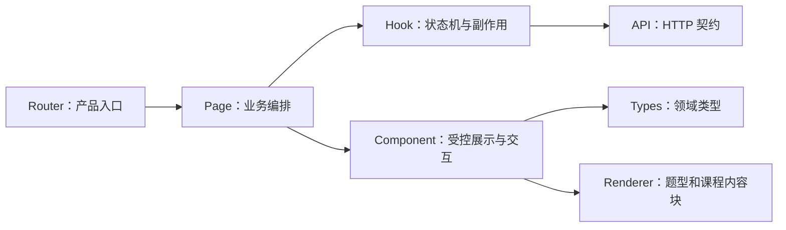
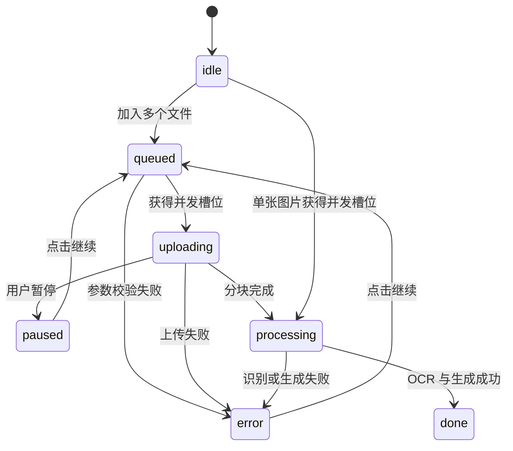

# 前端架构学习指南

本文面向希望通过 Dotty Tutor 学习 React、TypeScript、前端状态建模和 AI 产品交互的开发者。重点不是
逐个解释 JSX 标签，而是理解页面如何分层、状态由谁拥有、结构化题型如何复用，以及异步模型请求如何避免
竞态和界面错位。

## 1. 前端的四层结构



| 层 | 代表文件 | 主要职责 |
| --- | --- | --- |
| Router | `App.tsx` | 产品入口、懒加载、404 跳转和页面标题 |
| Page | `TextbookApp.tsx`、`MistakeCoachApp.tsx` | 组合业务状态、调用 Hook、切换页面模式 |
| Hook | `useTextbookImport.ts`、`usePaperPublication.ts`、`usePublishedLearningSession.ts` | 异步流程、状态转换、失败恢复 |
| Component | `PracticeWorkspace.tsx`、`StudentQuestionWorkspace.tsx`、`QuestionAnswer.tsx` | 按角色渲染并上报用户操作 |
| API | `api/` | 请求路径、序列化和统一错误解析 |
| Types | `types/` | 前后端稳定契约和判别联合类型 |
| Renderer | `lesson/`、画布组件 | 把结构化内容映射为可交互界面 |

依赖应从上向下。展示组件不应直接发请求；API 模块也不应读取 React State。

## 2. 从 `App.tsx` 理解角色入口

四个顶层页面使用 `React.lazy`：

```text
/              → ProductHome
/learn/*       → StudentLearningApp
/learn/papers/:id → PublishedPaperApp
/studio/*      → TextbookApp
/mistakes/*    → MistakeCoachApp
/textbooks/*   → 兼容跳转到 /studio
```

学生空间不包含教材上传、OCR 或模型设置，生产工作台才加载这些资源。路由级拆包使微信或普通浏览器打开
学生入口时只下载对应 JavaScript。`Suspense` 负责模块下载期间的稳定占位，而 `Navigate` 处理兼容地址和
未知路径。

学习时先观察路由如何决定“加载哪个产品”，再进入产品内部，不要从 CSS 或最深层组件开始。

## 3. 状态应该由谁拥有

判断状态放在哪里，可以使用“谁需要修改它”规则：

- 只影响一个按钮展开状态：放在组件，例如 `PracticeWorkspace` 的 `debugOpen`。
- 多个子组件共同使用：提升到 Page，例如当前题目、答案和掌握度。
- 包含请求、暂停/恢复或生命周期：放在 Hook，例如 PDF 上传任务。
- 需要刷新页面后恢复：放在后端数据库，前端只保存服务端返回的快照。

`PracticeWorkspace` 是内容生产端的受控组件，包含质量门禁、重新生成和调试信息；学生端不复用这个外壳，
而由 `StudentQuestionWorkspace` 只呈现作答、提示和反馈。两者共同复用 `QuestionAnswer`，因为题型输入是
真正稳定的跨角色能力。对于个人学习项目，这种“复用领域控件、不复用角色页面”比条件分支堆叠更容易追踪。

## 4. 教材导入状态机

`useTextbookImport.ts` 管理的是“队列状态 + 每个文件的有限状态”。后端已经按 `uploadId` 隔离每次上传，
前端因此不再用一个 `file` 状态反复覆盖当前文件，而是把每个 PDF/图片保存为 `uploads` 中的一项：



每个条目同时保存 `phase`、`progress`、`processingTask` 和 `result`，所以列表可以同时显示多个独立进度条；
点击条目只切换右侧处理链路和结果面板，不会中断其他任务。`MAX_CONCURRENT_UPLOADS = 3` 是本地 Demo 的保护阈值：
上传可以排队，但本地 MinerU/模型识别最多同时跑三个任务，避免瞬间启动过多重量级进程。每个运行中的条目还有
自己的暂停控制器和状态轮询器，暂停或失败只影响该条目，继续时复用已上传分块。

这里同时使用 State 和 Ref：

- `uploads`、`phase`、`progress`、`processingTask` 用 State，变化需要更新界面。
- 控制器 Map、已上传分块集合和运行中集合用 Ref，只保存跨 Render 的异步句柄，不把临时网络状态暴露给页面。

上传完成接口目前同步处理单个 PDF；Hook 通过多个独立请求并行展示进度。未来后端改为 Worker 时，可以把完成请求改成
“创建任务”，只需替换条目级轮询适配器，列表组件和交互不需要重写。

## 5. 教材练习如何按需生成

`TextbookApp.tsx` 同时维护：

- 当前 `payload`。
- 最多五题的 `questionBank`。
- 当前结构化答案和自由文本。
- 提示等级与内容质检预览结果。

每个 PDF 的首批页面完成后立即可做题；只有学生走到该教材已加载题目的末尾，才调用 `processPdfBatch()` 处理下一个五页范围。
这种延迟工作比“上传后处理整本书”更适合 Demo，也更符合速度优先的产品体验。

切换题目时必须成组清理文本答案、选项、填空、画线、语音、提示等级和旧回复。学生端随后按当前
`questionId` 从学习会话的 `attempts` 恢复最近一次已提交的结构化答案，因此清理只针对页面临时状态，
不会抹掉学生已经做过的题。`usePublishedLearningSession` 同时在提交前更新内存快照、网络失败时写入
本地队列；重新打开试卷会先读取服务端作答，再补传离线记录。模型的历史讲解不自动恢复，避免旧题反馈
串到新题，学生仍可显式点击“我需要提示”重新请求讲解。

恢复到已有作答的题目会把主按钮改为“重新提交答案”（画线题为“重新提交作图”），明确这是一次新的
判定，而不是重复创建页面状态。题目条件使用 `MathText` 渲染，历史数据里的 `$...$` 内联公式也不会再
作为普通文字显示。`MathText` 是所有用户可见题目/讲解文本的公式边界：除了标准 `$...$`，还兼容历史
裸 `\\frac` 等明确 LaTeX 命令，并只折叠已知的重复反斜杠。Canvas 只负责几何图形和固定标签；可含公式的
讲解文字通过 HTML overlay 交给 `MathText` 渲染，避免 Canvas 的 `fillText` 把 `$...$` 当普通字符。

内容生产端的作答只用于检查生成内容，不创建学习会话，也不累计掌握度。`usePaperPublication.ts` 将多题课程
保存为草稿，按 `draft → in_review → published` 送审发布；真正的学生作答发生在
`PublishedPaperApp.tsx`。

## 5.1 学生会话和离线同步

`usePublishedLearningSession.ts` 管理学生侧需要持久化的副作用：

1. 先尝试恢复 `localStorage` 中的会话 ID。
2. 本地数据库重建导致会话失效时，自动创建替代会话。
3. 每次作答生成稳定 `attemptId` 和原始 `createdAt`；请求失败便写入本地队列。
4. 页面再次打开后按会话批量补传，服务端依靠 `attemptId` 保证重试不重复累计。

这些规则放在 Hook 而非页面，是因为它们是一条可恢复状态机。Hook 同时读取掌握度投影，并在单次作答
成功后合并服务端返回的新状态；`PaperLearningProgress.tsx` 只负责展示当前知识点分数与累计证据，避免把
网络恢复、存储格式和练习 UI 混在同一组件中。

`usePublishedPaperProgress.ts` 是另一层纯前端派生状态机。它把发布试卷的题目顺序和不可变
`attempts` 日志合并成“每题最近一次判定”：只有最新 `assessment === correct` 才视为完成，
`partial` 或 `incorrect` 仍然留在原题允许重新提交。首次进入时会定位到第一道未完成题；正确提交
在答案已保存或进入离线队列后，再寻找下一道未完成题，最后一道完成后显示独立完成态。这个 Hook
故意不修改数据库或评分规则，因此刷新恢复、离线补传和页面导航共用同一份可回放的进度事实。

学生页面的“已完成”不是模型回复中的一句话，而是由上述派生状态计算出来的 UI 状态。模型回复只负责
解释本次作答；提交正确后即使模型文本晚到或网络切换，attempt 快照仍能驱动下一题和最终完成态。学生
作答过程也不会自动调用 TTS，避免切题和重复提交时产生无意义的语音请求。

## 6. 一套题型如何复用到多个产品入口

`QuestionAnswer.tsx` 根据 `questionType` 选择输入控件：

```text
choice / multi-select  → 选项按钮
true-false             → 判断按钮
fill-blank             → 多输入框
numeric                → 数值或公式输入
draw-line              → DrawLineCanvas
short-answer           → 页面提供自由文本区
```

组件不判断答案，也不调用模型。它只接收当前值和 `onChange`。教材练习和错题陪练因此能使用同一套控件，并把
答案转换为统一的 `interactionResult`：

```ts
{
  selectedOptions?: string[];
  blankAnswers?: Record<string, string>;
  numericAnswer?: string;
  connections?: Array<[string, string]>;
}
```

自由文本用于解释思路，结构化字段用于确定性判题。不要从文本“我选择 A”中反向解析答案。

### 试卷式题目展示

`QuestionContent.tsx` 负责组合题干、公式、图片和结构化选项，`MathText.tsx` 只负责 KaTeX 渲染。短文本选项
采用响应式网格，以接近纸质试卷的横向排列；图片或长文本选项继续使用单列，手机窄屏也会自动回到单列。

历史课程可能已经保存了 `A.` 选项尾巴或 `\textbackslash\text{%}`、`\textdegree C` 等旧模型输出。
前端只做有边界的显示兼容：隐藏已存在结构化选项的重复尾巴、在选项只剩 A-D 时恢复尾部原值，并修复已知
单位命令；新生成内容的正确性仍由后端规范化和质量门禁保证，避免把业务校验分散到展示组件。

工作台的生成模型、统一审核模型和 OCR 是三个独立选择器。`useTextbookImport()` 负责加载与切换 Runtime，
`RuntimeSettings.tsx` 只展示目录。试卷已经送审或发布后，`usePaperPublication()` 可以调用版本接口整套
重生成；成功后页面切到新题库和 `in_review` 版本，旧版本不会从学生历史中消失。

## 7. 类型目录为什么要按领域拆分

根 `types.ts` 只有兼容导出。真实定义位于：

- `types/question.ts`：题目、答案规范、画线和模型运行信息。
- `types/lesson.ts`：课程文档与内容块判别联合。
- `types/publication.ts`：互动试卷发布状态与学生可见投影。
- `types/textbook.ts`：上传任务、教材批次和导入结果。
- `types/mistake.ts`：错题与错误原因。
- `types/tutoring.ts`：多轮线程、消息和请求。
- `types/runtime.ts`：模型/OCR 选择。

初学者可以继续从 `../types` 导入；阅读具体领域时直接打开对应文件。不要为每个组件创建一份重复的后端
响应类型，否则字段变化会产生多个不一致版本。

## 8. API 模块和错误处理

`api/` 与 `types/` 使用相同领域划分。所有模块复用 `api/client.ts` 的 `parse<T>()`：

1. 解析 JSON。
2. 非 2xx 时读取 FastAPI 的 `detail`。
3. 拒绝无法解析的空响应。
4. 返回调用方指定的 TypeScript 类型。

API 层不显示 Toast，也不修改页面状态。Hook 或 Page 决定错误应该显示在哪里，以及是否允许重试。

### 8.1 阶段四页面怎样保持组件简单

错题闭环仍遵守 Page、Hook、API 和展示组件四层：

- `MistakeProgress` 只布局统计、任务列表和知识点进度。
- `useReviewProgress` 负责并行读取、任务状态更新和统一错误状态。
- `ReviewTaskCard` 只管理当前题的临时输入并渲染可复用 `QuestionAnswer`。
- `structuredAnswer.ts` 把选择、填空和数值控件统一转换为后端契约。

因此复习题没有复制教材页或变式题的作答判断逻辑。未来增加新的结构化题型时，应先扩展共享答案转换，
再让各业务页面复用，而不是在每个 Card 中分别拼请求 JSON。

## 9. 可编程课程和 Renderer Registry

`LessonBlock` 是 TypeScript 判别联合。每种内容块都有固定的 `type` 和 `payload`：

```text
markdown | formula | diagram | animation | annotation | quiz | hint
```

`rendererRegistry.tsx` 把类型映射到 Renderer。`LessonPlayer` 只负责当前步骤、播放状态和导航，不需要知道每种
内容如何画出来。新增内容块的推荐顺序：

1. 在 `types/lesson.ts` 增加契约。
2. 增加对应 Renderer。
3. 注册到 `rendererRegistry.tsx`。
4. 增加渲染测试或 Playwright 路径。

不要在 `LessonPlayer` 中不断追加 `if (type === ...)`，否则播放状态和渲染规则会重新耦合。

## 10. TTS 为什么需要缓存和请求编号

本地 Qwen3-TTS 可能比浏览器语音慢。`speech.ts` 使用两种机制保持语音和动画同步：

- `speechCache` 缓存 `Promise<Blob>`，并发预加载相同文本只发送一次请求。
- `speechRequestId` 是递增令牌；用户切换步骤后，旧异步请求即使完成也不能开始播放。
- `pendingSpeechControllers` 保存尚未返回的 `fetch`，切换题目、步骤或发起新的语音时会调用 `AbortController.abort()`；
  这样旧请求不再继续占用浏览器连接。课程只预热当前步骤（课程刚打开时预热第一步），不会一次性请求整节课。

`LessonPlayer` 在课程加载时只预取第一步，播放当前步骤前再按需请求。画布动作在音频真正开始时触发，
而不是点击播放后立即触发。学生端是静音作答边界：选项、填空、数值、画线或文字输入以及提交答案
都会停止已有语音；学生端展示讲解区域不会自动预取，只有显式点击“播放讲解”才请求 TTS。
服务不可用时再回退浏览器 `SpeechSynthesis`。

这是典型的前端竞态问题：取消视觉状态还不够，还要让已经发出的异步 continuation 失效。

## 11. 前端测试策略

当前主路径主要由 TypeScript 构建和 Playwright 保护：

```bash
cd frontend
npm ci
npm run build
npm run test:e2e
```

- `tsc --noEmit` 检查前后端契约使用是否一致。
- Vite Build 检查模块边界和生产打包。
- Playwright 从用户角度验证角色入口、学生/生产边界、教材导入、题型作答和错题多轮流程。

继续扩展时，可以为纯函数增加 Vitest，例如 `fileValidation.ts`、`questionPresentation.ts` 和课程文档转换；
不需要为每个静态 JSX 标签编写快照测试。

## 12. 注释约定

前端注释优先说明以下内容：

- 为什么使用 Ref 而不是 State。
- 为什么异步 Effect 需要取消标记。
- 为什么某个请求允许失败但不阻塞主流程。
- 为什么组件保持受控或保持较长 Props。
- 为什么需要缓存、请求令牌或惰性加载。

变量名已经能表达的内容不重复注释。复杂条件优先提取成有含义的变量或函数，注释只补充设计约束。

## 13. 推荐学习练习

1. 给 `questionPresentation.ts` 的一个纯函数增加 Vitest。
2. 增加一种只读课程内容块并注册 Renderer。
3. 给 PDF 状态机增加“取消任务”界面，但不引入全局状态库。
4. 为 `useMistakeTutor` 增加网络失败重试，同时保留学生草稿。
5. 使用 Playwright 验证快速切换课程步骤不会播放旧语音。

继续阅读：[后端架构学习指南](backend-learning-guide.md)、[代码结构指南](codebase-guide.md)、
[系统架构](architecture.md)和[本地开发指南](development.md)。
