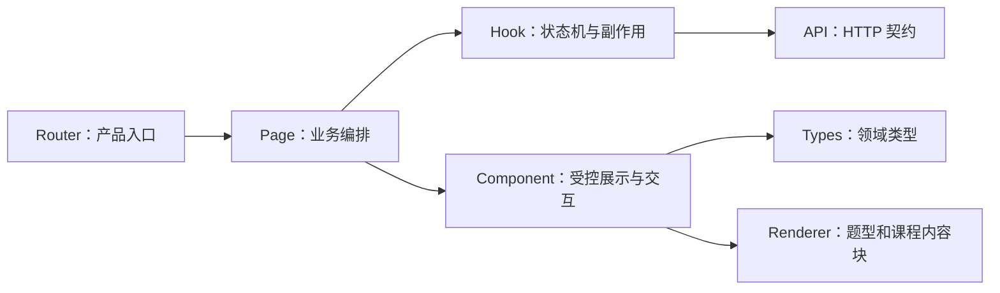
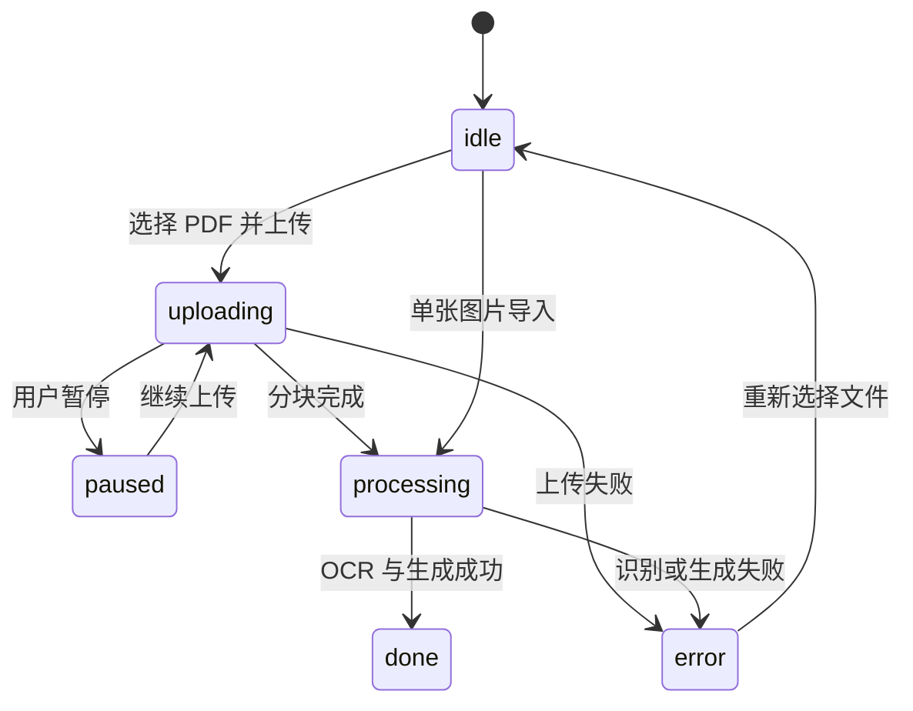

# 前端架构学习指南

本文面向希望通过 Dotty Tutor 学习 React、TypeScript、前端状态建模和 AI 产品交互的开发者。重点不是
逐个解释 JSX 标签，而是理解页面如何分层、状态由谁拥有、结构化题型如何复用，以及异步模型请求如何避免
竞态和界面错位。

## 1. 前端的四层结构



| 层 | 代表文件 | 主要职责 |
| --- | --- | --- |
| Router | `App.tsx` | 产品入口、懒加载、404 跳转和页面标题 |
| Page | `TextbookApp.tsx`、`MistakeCoachApp.tsx` | 组合业务状态、调用 Hook、切换页面模式 |
| Hook | `useTextbookImport.ts`、`useMistakeTutor.ts` | 异步流程、状态转换、失败恢复 |
| Component | `PracticeWorkspace.tsx`、`QuestionAnswer.tsx` | 根据 Props 渲染并上报用户操作 |
| API | `api/` | 请求路径、序列化和统一错误解析 |
| Types | `types/` | 前后端稳定契约和判别联合类型 |
| Renderer | `lesson/`、画布组件 | 把结构化内容映射为可交互界面 |

依赖应从上向下。展示组件不应直接发请求；API 模块也不应读取 React State。

## 2. 从 `App.tsx` 理解双产品入口

三个顶层页面使用 `React.lazy`：

```text
/             → ProductHome
/textbooks/*  → TextbookApp
/mistakes/*   → MistakeCoachApp
```

教材播放器包含公式、画布和课程渲染代码，错题入口不需要这些资源。路由级拆包使微信或普通浏览器打开某个
入口时只下载对应 JavaScript。`Suspense` 负责模块下载期间的稳定占位，而 `Navigate` 把未知地址恢复到首页。

学习时先观察路由如何决定“加载哪个产品”，再进入产品内部，不要从 CSS 或最深层组件开始。

## 3. 状态应该由谁拥有

判断状态放在哪里，可以使用“谁需要修改它”规则：

- 只影响一个按钮展开状态：放在组件，例如 `PracticeWorkspace` 的 `debugOpen`。
- 多个子组件共同使用：提升到 Page，例如当前题目、答案和掌握度。
- 包含请求、暂停/恢复或生命周期：放在 Hook，例如 PDF 上传任务。
- 需要刷新页面后恢复：放在后端数据库，前端只保存服务端返回的快照。

`PracticeWorkspace` 的 Props 较多是有意选择。它是受控组件，只表达“现在显示什么”和“用户做了什么”，
不会偷偷请求后端。对于个人学习项目，这比引入全局状态库更容易追踪；只有跨多个不相邻路由共享状态时，
才考虑 Context 或 Zustand。

## 4. 教材导入状态机

`useTextbookImport.ts` 管理下面的有限状态：



这里同时使用 State 和 Ref：

- `phase`、`progress`、`processingTask` 用 State，变化需要更新界面。
- `pdfTaskRef` 和 `pauseRequested` 用 Ref，需要跨 Render 保存，但每个分块变化不应触发重新渲染。

上传完成接口目前同步处理 PDF；Hook 并行轮询只用于显示进度。未来后端改为 Worker 时，可以把完成请求改成
“创建任务”，继续复用轮询和现有展示组件。

## 5. 教材练习如何按需生成

`TextbookApp.tsx` 同时维护：

- 当前 `payload`。
- 最多五题的 `questionBank`。
- 当前结构化答案和自由文本。
- 学习会话、提示等级与掌握度。

首批 PDF 完成后立即可做题；只有学生走到已加载题目的末尾，才调用 `processPdfBatch()` 处理下一个五页范围。
这种延迟工作比“上传后处理整本书”更适合 Demo，也更符合速度优先的产品体验。

切换题目时必须成组清理文本答案、选项、填空、画线、语音、提示等级和旧回复。`resetLearningState()` 把这个
不变量集中管理，避免上一题状态泄漏到下一题。

## 6. 一套题型如何复用到两个产品

`QuestionAnswer.tsx` 根据 `questionType` 选择输入控件：

```text
choice / multi-select  → 选项按钮
true-false             → 判断按钮
fill-blank             → 多输入框
numeric                → 数值或公式输入
draw-line              → DrawLineCanvas
short-answer           → 页面提供自由文本区
```

组件不判断答案，也不调用模型。它只接收当前值和 `onChange`。教材练习和错题陪练因此能使用同一套控件，并把
答案转换为统一的 `interactionResult`：

```ts
{
  selectedOptions?: string[];
  blankAnswers?: Record<string, string>;
  numericAnswer?: string;
  connections?: Array<[string, string]>;
}
```

自由文本用于解释思路，结构化字段用于确定性判题。不要从文本“我选择 A”中反向解析答案。

## 7. 类型目录为什么要按领域拆分

根 `types.ts` 只有兼容导出。真实定义位于：

- `types/question.ts`：题目、答案规范、画线和模型运行信息。
- `types/lesson.ts`：课程文档与内容块判别联合。
- `types/textbook.ts`：上传任务、教材批次和导入结果。
- `types/mistake.ts`：错题与错误原因。
- `types/tutoring.ts`：多轮线程、消息和请求。
- `types/runtime.ts`：模型/OCR 选择。

初学者可以继续从 `../types` 导入；阅读具体领域时直接打开对应文件。不要为每个组件创建一份重复的后端
响应类型，否则字段变化会产生多个不一致版本。

## 8. API 模块和错误处理

`api/` 与 `types/` 使用相同领域划分。所有模块复用 `api/client.ts` 的 `parse<T>()`：

1. 解析 JSON。
2. 非 2xx 时读取 FastAPI 的 `detail`。
3. 拒绝无法解析的空响应。
4. 返回调用方指定的 TypeScript 类型。

API 层不显示 Toast，也不修改页面状态。Hook 或 Page 决定错误应该显示在哪里，以及是否允许重试。

## 9. 可编程课程和 Renderer Registry

`LessonBlock` 是 TypeScript 判别联合。每种内容块都有固定的 `type` 和 `payload`：

```text
markdown | formula | diagram | animation | annotation | quiz | hint
```

`rendererRegistry.tsx` 把类型映射到 Renderer。`LessonPlayer` 只负责当前步骤、播放状态和导航，不需要知道每种
内容如何画出来。新增内容块的推荐顺序：

1. 在 `types/lesson.ts` 增加契约。
2. 增加对应 Renderer。
3. 注册到 `rendererRegistry.tsx`。
4. 增加渲染测试或 Playwright 路径。

不要在 `LessonPlayer` 中不断追加 `if (type === ...)`，否则播放状态和渲染规则会重新耦合。

## 10. TTS 为什么需要缓存和请求编号

本地 Qwen3-TTS 可能比浏览器语音慢。`speech.ts` 使用两种机制保持语音和动画同步：

- `speechCache` 缓存 `Promise<Blob>`，并发预加载相同文本只发送一次请求。
- `speechRequestId` 是递增令牌；用户切换步骤后，旧异步请求即使完成也不能开始播放。

`LessonPlayer` 在课程加载时预取所有步骤，在当前语音播放时继续预热下一步。画布动作在音频真正开始时触发，
而不是点击播放后立即触发。服务不可用时再回退浏览器 `SpeechSynthesis`。

这是典型的前端竞态问题：取消视觉状态还不够，还要让已经发出的异步 continuation 失效。

## 11. 前端测试策略

当前主路径主要由 TypeScript 构建和 Playwright 保护：

```bash
cd frontend
npm ci
npm run build
npm run test:e2e
```

- `tsc --noEmit` 检查前后端契约使用是否一致。
- Vite Build 检查模块边界和生产打包。
- Playwright 从用户角度验证双入口、教材导入、题型作答和错题多轮流程。

继续扩展时，可以为纯函数增加 Vitest，例如 `fileValidation.ts`、`questionPresentation.ts` 和课程文档转换；
不需要为每个静态 JSX 标签编写快照测试。

## 12. 注释约定

前端注释优先说明以下内容：

- 为什么使用 Ref 而不是 State。
- 为什么异步 Effect 需要取消标记。
- 为什么某个请求允许失败但不阻塞主流程。
- 为什么组件保持受控或保持较长 Props。
- 为什么需要缓存、请求令牌或惰性加载。

变量名已经能表达的内容不重复注释。复杂条件优先提取成有含义的变量或函数，注释只补充设计约束。

## 13. 推荐学习练习

1. 给 `questionPresentation.ts` 的一个纯函数增加 Vitest。
2. 增加一种只读课程内容块并注册 Renderer。
3. 给 PDF 状态机增加“取消任务”界面，但不引入全局状态库。
4. 为 `useMistakeTutor` 增加网络失败重试，同时保留学生草稿。
5. 使用 Playwright 验证快速切换课程步骤不会播放旧语音。

继续阅读：[后端架构学习指南](backend-learning-guide.md)、[代码结构指南](codebase-guide.md)、
[系统架构](architecture.md)和[本地开发指南](development.md)。
