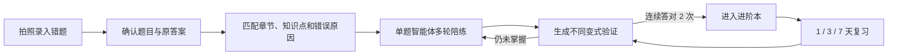

# AI 错题陪练产品规划

本文定义 Dotty Tutor 在保留教材数字化能力的前提下，扩展个人错题陪练产品的目标、边界、
复用策略和分阶段交付计划。错题陪练与教材互动学习共用一个仓库和技术底座，但使用独立入口与
学习流程，避免把教师/开发调试功能暴露给学生。

## 产品定位

目标用户是小学至高中及中职的个人学生，首个可用版本聚焦**初中数学**。产品强调三件事：

- **轻**：移动端网页直接使用，后续可通过二维码在微信内打开，不要求安装 App。
- **准**：错题落到具体教材章节、知识点和错误原因，允许学生确认和修正 AI 结果。
- **闭环**：不止保存错题，还要通过多轮陪练、变式验证和复习计划确认学生真正掌握。

Dotty Tutor 的总定位调整为“个人 AI 学习工具”，包含两个产品入口：

| 入口 | 路径 | 主要任务 | 当前状态 |
| --- | --- | --- | --- |
| 教材互动学习 | `/textbooks` | 教材导入、结构化出题、课程播放和互动练习 | 已可用 |
| AI 错题陪练 | `/mistakes` | 错题录入、诊断、多轮辅导、掌握验证和复习 | 第一阶段骨架 |

## 核心用户闭环



错误原因是后续策略的核心数据，不作为可有可无的标签。第一版使用以下稳定枚举：

| 标识 | 中文 | 后续策略示例 |
| --- | --- | --- |
| `concept` | 概念不清 | 先解释定义，再做基础辨析 |
| `reading` | 审题错误 | 让学生标出条件与问题 |
| `calculation` | 计算失误 | 生成同类型分步计算练习 |
| `missing_step` | 步骤遗漏 | 要求补齐推导或证明链 |
| `unknown` | 完全不会 | 从前置知识开始逐级提升 |
| `careless` | 粗心大意 | 增加检查清单和限时复核 |

## 单题智能体设计

每道错题进入陪练页后拥有独立线程，不把一次模型生成当成完整辅导。状态机为：

```text
diagnose → explain → practice → verify → mastered
               ↑         │          │
               └─────────┴──────────┘
```

智能体根据学生的文字、选项、公式、图片或画板输入决定下一步，并通过受约束工具写入业务数据：

- `evaluate_answer`：调用确定性判题，模型不自行宣布对错。
- `diagnose_error_reason`：生成可由学生确认的错误原因。
- `explain_misconception`：按当前误区生成短解释。
- `select_next_hint`：只返回当前所需的一层提示。
- `generate_practice_question`：生成同知识点、不同表述的练习。
- `update_mastery`：根据验证结果更新掌握状态。
- `schedule_review`：创建后续复习任务。

达到“已掌握”必须同时满足：未使用高层级提示，并连续答对两道不同变式题。MVP 的复习间隔为
1、3、7 天；后续再基于题目难度和历史表现调整。

## 代码复用边界

### 直接复用

- OCR 与题图提取：`backend/ocr_runtime.py`。
- 结构化生成：`backend/model_runtime.py`、`backend/question_pipeline.py`。
- 题型与答案契约：`backend/question_contracts.py`。
- 确定性判题：`backend/answer_evaluator.py`。
- 审校与质量门禁：`backend/review_runtime.py`。
- 应用、日志、PostgreSQL、Docker 与 Playwright 基础设施。
- 前端公式、题图和结构化作答组件。

### 适配后复用

- `backend/tutor_engine.py`：从单次 Help 扩展为带线程状态的策略引擎。
- `backend/storage.py`：增加错题、消息和复习任务仓储，不继续堆积单文件职责。
- `frontend/src/components/PracticeWorkspace.tsx`：抽出可在错题陪练中复用的题目与答案区域。
- `backend/learning_routes.py`：保留掌握度逻辑，增加验证次数和复习计划。

### 学生入口不直接复用

- 大 PDF 批处理、模型/OCR 选择器、审校产物和重新生成按钮。
- 默认四步课程播放器。它可作为深度讲解资源，但不是每次对话的固定流程。
- 任何暴露模型、提示词或内部质量信息的开发调试界面。

## 目标架构

前端按产品域拆分，同时把真正通用的题目组件放入共享层：

```text
frontend/src/
  apps/
    home/                 # 产品入口
    textbook/             # 教材互动学习
    mistake/              # 错题陪练
  components/             # 通用题目、公式、画板与反馈组件
  lesson/                 # 可编程课程播放器
  api.ts
  types.ts
```

后端在后续阶段按业务域增加模块，避免把新接口继续写入 `backend/app.py`：

```text
backend/
  mistakes/               # 错题录入、归类和仓储
  tutoring/               # 线程、消息、状态机和工具调用
  learning/               # 掌握验证与复习调度
```

计划新增的核心数据模型：

- `mistake_items`：题目快照、学生原答案、知识点、错误原因和状态。
- `tutor_threads`：一题一线程，记录当前辅导阶段与摘要。
- `tutor_messages`：学生输入、助手输出、结构化动作和模型运行信息。
- `review_tasks`：复习时间、题目来源、完成状态和验证结果。

线程只保存业务所需的结构化上下文和摘要，不无限重放全部消息，控制延迟与 token 成本。

## 分阶段交付

### 第一阶段：双产品入口（当前）

- 根路径展示产品选择页。
- `/textbooks` 承载现有教材互动学习，行为和接口保持不变。
- `/mistakes` 建立移动端优先的独立产品页和后续流程说明。
- 拆分原有大体积 `App.tsx`，根组件只负责路由，教材状态归入产品域组件。
- 增加入口和直接路由的 Playwright 回归测试。

### 第二阶段：错题录入与确认

- 单张图片上传、裁切与 OCR。
- 展示题干、公式、题图和学生原答案，允许手动修正。
- 匹配教材章节与知识点，记录可修正的错误原因。
- 新增 `mistake_items` 表和错题本列表。

### 第三阶段：有状态单题陪练

- 新增线程和消息模型、线程 API 与辅导状态机。
- 支持文字和已有结构化作答输入，逐步接入图片与画板。
- 确定性判题负责结果，模型负责诊断、提示与追问。
- 使用摘要和有限上下文控制多轮成本。

### 第四阶段：掌握验证与复习

- 按错误原因生成不同策略的变式题。
- 连续答对两次后从错题本迁移到进阶本。
- 建立 1、3、7 天复习任务和学习进度页。

### 第五阶段：微信移动体验

- 完成小屏、触控、拍照权限与弱网体验。
- 二维码入口和微信内浏览器兼容性验证。
- 在身份体系完成前继续使用受控演示数据，不采集真实学生隐私。

### 第六阶段：质量与演示

- 补齐关键路径 Playwright、真实 PostgreSQL 集成测试与模型评测集。
- 增加首屏、响应耗时、模型失败和学习闭环指标。
- 准备可重复运行、无需临场生成全部内容的演示数据。

建议对应分支：

```text
feature/dual-product-entry
feature/mistake-capture
feature/stateful-tutor-thread
feature/mastery-review-loop
feature/mobile-mistake-experience
test/mistake-coach-e2e
```

## 性能和成本目标

- 移动端入口可交互时间小于 2 秒。
- 确定性判题响应小于 500 ms。
- 智能体文本回复目标 P50 小于 5 秒、P95 小于 10 秒。
- TTS、动画和知识点讲解优先缓存或异步预生成，不阻塞第一条文字反馈。
- 每轮只携带题目快照、状态摘要和最近必要消息，记录 provider、耗时、token 与回退原因。

## MVP 明确不做

- 同时覆盖全部学段、学科和教材版本。
- 每道题实时生成讲解视频。
- 微信登录、支付、教师后台和班级管理。
- 复杂手写公式识别和任意画板语义理解。
- 多智能体协作、微服务拆分或 Kubernetes。
- 无人工确认地自动生成整本教材知识树。

这些能力不是永远不做，而是不应阻塞“录入一题—陪练—验证掌握”这一条最小闭环。
