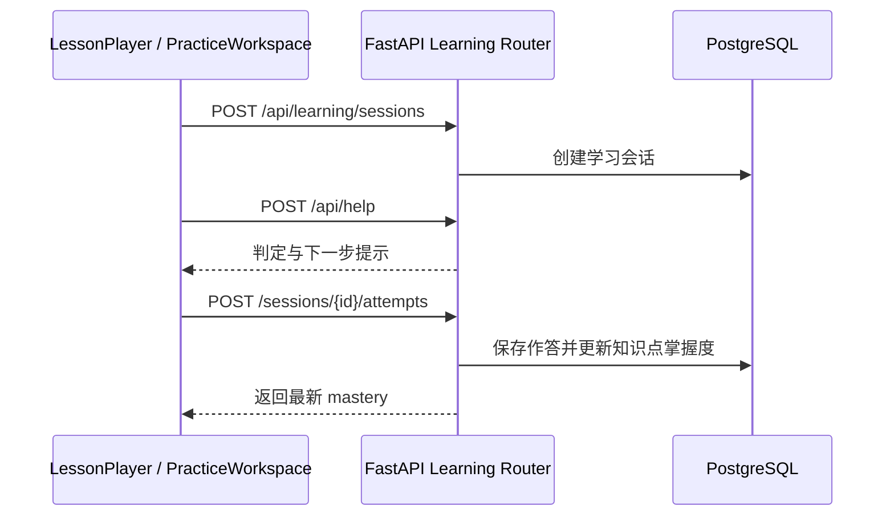

# 可编程课程与学习闭环

Dotty Tutor 将教材题目转换成带版本的 `LessonDocument`，前端通过渲染器注册表播放内容，
后端记录学习会话、作答与知识点掌握度。这样，课程不再固定写在一个 React 页面里，也能逐步接入
Manim、Canvas、WebGL 或其他内容生成工具。

## LessonDocument

`LessonDocument` 是课程内容的稳定边界：

```json
{
  "lessonId": "linear-equation-1",
  "title": "一元一次方程",
  "version": 1,
  "status": "published",
  "sourceUploadId": "upload-id",
  "knowledgePoints": ["移项"],
  "blocks": [
    {
      "id": "move-term",
      "type": "diagram",
      "title": "移项",
      "payload": {
        "renderer": "geometry",
        "action": "show-base",
        "text": "把常数项移到右边。",
        "speechText": "先完成移项。"
      }
    }
  ]
}
```

当前支持以下内容块：

| 类型 | 用途 | 当前渲染方式 |
| --- | --- | --- |
| `markdown` | 文字讲解 | 文本内容块 |
| `formula` | 独立公式 | KaTeX |
| `diagram` | 可交互图形步骤 | `GeometryCanvas` |
| `animation` | 预生成动画 | HTML Video |
| `annotation` | 重点、旁注和纠错 | 标注卡片 |
| `quiz` | 结构化练习入口 | 由练习工作区承载 |
| `hint` | 分层提示 | 提示卡片 |

`backend/lesson_contracts.py` 负责 Schema 校验和旧 `QuestionPayload` 适配，
`frontend/src/lesson/rendererRegistry.tsx` 负责把块类型映射到组件。增加新表达形式时，应新增块契约和
独立渲染器，避免继续扩张 `App.tsx`。

## 学习数据闭环



掌握度目前是可解释的轻量启发式：正确、部分正确、错误分别映射为 `1.0`、`0.55`、`0`，
新分数由 70% 历史分数和 30% 本次结果组成。它适合 MVP 展示与数据积累，不应被视作正式测评成绩。

## 持久化

- `lesson_documents`：课程版本、状态、知识点和内容块。
- `learning_sessions`：学习者进入某节课程的会话。
- `exercise_attempts`：原始回答、判定、提示层级与耗时。
- `mastery_states`：按学习者和知识点聚合的当前掌握度。

开发环境仍会通过 SQLAlchemy `create_all()` 幂等初始化；受控部署可先执行
`backend/migrations/001_programmable_learning.sql`。后续应引入 Alembic，迁移历史建立后停止把
`create_all()` 当作生产迁移工具。

## 当前边界

- 前端暂用 `local-demo` 作为匿名学习者，接入登录后必须改为服务端身份。
- 课程保存 API 暂未加教师角色与发布审核权限，不应直接暴露到匿名公网。
- `animation` 只负责播放已有资源，尚未引入 Manim 渲染 worker、对象存储和任务队列。
- 掌握度尚未包含遗忘曲线、题目难度、猜测概率和跨题知识图谱。
