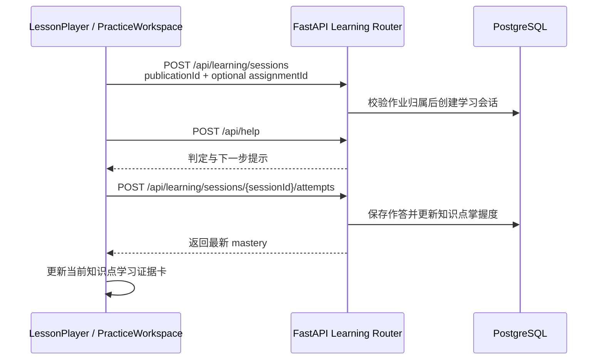

# 可编程课程与学习闭环

Dotty Tutor 将教材题目转换成带版本的 `LessonDocument`，前端通过渲染器注册表播放内容，
后端提供学习会话、作答与知识点掌握度的记录能力。这样，课程不再固定写在一个 React 页面里，
也能逐步接入 Manim、Canvas、WebGL 或其他内容生成工具。

> 学习记录接口已由学生侧互动试卷调用；内容生产工作台的作答仍只属于内容质检，不创建学习会话，
> 也不会累计学生掌握度。

可编程课程是教材互动学习的主要表达方式，也可以在错题陪练的 `explain` 阶段作为可选深度讲解资源；
它不会替代错题线程的多轮状态机。错题产品的整体设计见
[AI 错题陪练产品规划](mistake-coach-plan.md)。

## LessonDocument

`LessonDocument` 是课程内容的稳定边界。生成后默认处于 `draft`（质量门禁未通过时为 `in_review`），
必须通过内容生产端的互动试卷发布流程后才会进入学生可见的 `published` 状态：

```json
{
  "lessonId": "linear-equation-1",
  "title": "一元一次方程",
  "version": 1,
  "status": "published",
  "sourceUploadId": "upload-id",
  "knowledgePoints": ["移项"],
  "blocks": [
    {
      "id": "move-term",
      "type": "diagram",
      "title": "移项",
      "payload": {
        "renderer": "geometry",
        "action": "show-base",
        "text": "把常数项移到右边。",
        "speechText": "先完成移项。"
      }
    }
  ],
  "questionPayload": {"question": {"id": "linear-equation-1"}},
  "guideCards": []
}
```

多个 `LessonDocument` 通过 `lesson_publications` 组成一份互动试卷。试卷先进入 `in_review`，
发布时再次检查每道题的质量门禁。生成阶段对结构失败的单题自动修复一次；仍不合格的题会自动从本次发布中
隔离，合格题继续发布。若没有任何题目合格，发布会安全失败并保留诊断信息。学生端只读取
`published` 试卷，不接触草稿、审校记录、隔离题或模型配置。

当前支持以下内容块：

| 类型 | 用途 | 当前渲染方式 |
| --- | --- | --- |
| `markdown` | 文字讲解 | 文本内容块 |
| `formula` | 独立公式 | KaTeX |
| `diagram` | 可交互图形步骤 | `GeometryCanvas` |
| `animation` | 预生成动画 | HTML Video |
| `annotation` | 重点、旁注和纠错 | 标注卡片 |
| `quiz` | 结构化练习入口 | 由练习工作区承载 |
| `hint` | 分层提示 | 提示卡片 |

`apps/api/domain/contracts/lesson.py` 负责 Schema 校验和旧 `QuestionPayload` 适配，
`apps/web/src/lesson/rendererRegistry.tsx` 负责把块类型映射到组件。增加新表达形式时，应新增块契约和
独立渲染器，避免继续扩张 `App.tsx`。

## 渲染与交互边界

题目内容和交互是两个正交维度；一道题通常同时包含多种内容形式：

```text
Question Schema
├── contentBlocks（结构化内容，按块类型渲染）
│   ├── text    → 文本内容块
│   ├── math    → KaTeX / MathText
│   ├── image   → 图片渲染器
│   ├── options → 选项渲染器
│   └── table   → 表格渲染器
└── interactionSpec（未来：交互数学实验）
      └── InteractiveMathCanvas
            └── Renderer Adapter
                  ├── Mafs（实验）
                  └── JSXGraph（实验）
                        ↓
                  评测后只保留一个
```

- Schema 描述教学内容和交互意图，不描述具体前端库；`interactionSpec` 中禁止出现绘图库或 React 组件名称。
- `InteractiveMathCanvas` 统一管理交互状态、结构化作答和事件；Adapter 把统一交互协议翻译为具体库配置。
- 只有交互数学运行时可以产生参与判题的结构化作答。
- `interactionSpec` 产生的作答复用现有 `answerSpec` 判题契约，不新建第二套评分机制。

## 动画与学习状态分层

动画系统区分三个问题——播放什么、何时播放、如何表现——并保持单向依赖：

```text
LessonDocument.blocks（animation 块）      Learning Result
        │ 播放什么                            │ 何时触发
        │                                    ↓
        │                        Presentation Policy（纯函数）
        │                                    │ 如何表现
        ↓                          ──────────┴──────────
Animation Asset                             ↓
        │                              UI Feedback
        ↓                           （当前仅 CSS transition）
HTML <video> + 字幕 + 暂停点
```

| 能力 | 主要用途 | 参与判题 |
| --- | --- | --- |
| CSS transition（当前唯一实现） | 按钮、卡片、进度反馈 | 否 |
| Lottie（未引入） | 完成、提示和掌握升级动效 | 否 |
| Manim（未引入） | 预生成数学推导或证明视频 | 否 |
| Motion Canvas（未引入） | 参数化时间轴和步骤动画 | 否 |

不变量：

- 学习状态中不出现 `playLottie: true` 等表现字段；表现策略是纯函数映射，不持久化。
- 动画层只读消费状态或内容，不回写掌握度；动画播放完成不作为作答正确或掌握的证据。
- 内容块决定播放什么，Learning Result 决定何时考虑触发，Presentation Policy 决定具体效果。

## 学习数据闭环



学生端为每条作答生成稳定的 `attemptId`。请求失败时记录暂存在浏览器队列，恢复网络后通过
`POST /api/learning/sessions/{sessionId}/sync` 批量补传；服务端以主键保证重复提交幂等。记录同时保存
浏览器生成的原始 `createdAt`，因此离线补传仍按实际作答时间排序。学习会话查询同时返回按时间排列的
`attempts` 作答快照；学生端按 `questionId` 回填最近一次选择、填空、数值或画线答案，刷新和切题不会
丢失已提交状态。学习会话绑定整份互动试卷的 `publicationId`，不是单道课程；从作业进入时还会保存可选的
`assignmentId`，服务端校验该作业的班级和发布版本归属。浏览器中的旧会话若因本地数据库重建而失效，学生 Hook
会创建替代会话并重新绑定尚未送达的记录。

互动试卷的推进由 `usePublishedPaperProgress` 派生，不依赖服务端增加“当前题号”字段：

1. 按 `questionId` 取最新一次 attempt，保留完整日志作为学习证据。
2. 只有 `correct` 标记当前题完成，`partial`/`incorrect` 允许学生重新提交并覆盖当前题的派生状态。
3. 正确提交在保存成功或进入离线队列后推进到下一道未完成题；全部题目正确时进入完成态。
4. 重新打开试卷时从第一道未完成题开始；完成态可以回看已完成题目，但不会重新产生学习记录。

这是有意放在前端 Hook 的“展示状态机”，不改变 `exercise_attempts` 的不可变日志、掌握度算法或后端
评分契约。这样网络慢时也能先保留答案，模型讲解晚到时不会阻塞学生换题。学生作答阶段不自动触发
TTS，语音只属于明确的“请求讲解”动作。

掌握度目前是可解释的轻量启发式：正确、部分正确、错误分别映射为 `1.0`、`0.55`、`0`；对每个发布版本
的每道题只取最新作答，`rawScore` 是不同题证据的平均值，再乘以随证据数量增长的 `evidenceConfidence`
得到 `score`。它适合 MVP 展示与数据积累，不应被视作正式测评成绩。算法纯函数位于
`apps/api/domain/learning/mastery.py`，掌握度表是可重建投影，不是学习事实的唯一来源。

## 持久化

- `lesson_documents`：课程版本、状态、知识点和内容块。
- `lesson_publications`：互动试卷标题、题目顺序、发布状态、教材来源、版本和前一版本。
- `learning_sessions`：学习者进入一份已发布互动试卷的会话。
- `knowledge_points`：按发布版本和规范化名称建立稳定知识点实体。
- `exercise_attempts`：原始回答、判定、提示层级、耗时以及服务端解析出的发布版本和知识点 ID。
- `mastery_states`：按学习者和知识点聚合的当前 mastery-v2 掌握度投影。

数据库测试通过 PostgreSQL 测试夹具先升级到当前 schema；PostgreSQL 运行时不执行 DDL。已有数据库需要先备份，再在
`apps/api` 依次执行统一 CLI 的 `preflight`、`upgrade` 和 `verify` 命令。版本链会保留旧掌握度表，从作答证据重建新投影，
并将没有作答证据的旧行标记为 legacy；正式迁移依次执行 `preflight`、`upgrade` 和 `verify`，
`scripts/migrate_mastery_v2.py` 仅是 deprecated 兼容包装器。

## 当前边界

- 前端暂用 `local-demo` 作为匿名学习者，接入登录后必须改为服务端身份。
- 课程保存 API 暂未加教师角色与发布审核权限，不应直接暴露到匿名公网。
- `animation` 只负责播放已有资源，尚未引入 Manim 渲染 worker、对象存储和任务队列。
- 掌握度尚未包含遗忘曲线、题目难度、猜测概率和跨题知识图谱；当前知识点 ID 仍按发布版本隔离，尚未做跨教材聚合。
- `mistake_items` 保存错题录入和确认结果，`tutor_threads` 与 `tutor_messages` 独立保存多轮状态、
  摘要和必要消息；变式验证与复习任务使用独立的 `variation_exercises`、`review_tasks` 表和 API，
  不改变课程学习会话的掌握度模型。
