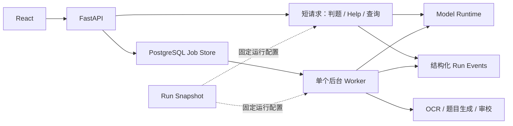

# AI 运行治理与后台任务演进计划

> 状态：G1/G2 已落地，G3 仍在规划中。本文保留下一阶段的演进顺序和验收标准，并标注已经实现的边界。

Dotty Tutor 已经拥有模型、OCR、审校、TTS、状态机和 PostgreSQL 持久化等基础能力。下一步的重点不是
引入更多代理框架，而是让一次 AI 处理过程可以被复现、观察、取消和评测。本计划参考通用 Agent Platform
中的 Control Plane、Data Plane、Model Gateway 和 Job Store 思想，但按个人学习项目的规模做最小化落地。

## 设计原则

1. **先解决可解释性，再增加编排框架**：先知道一次运行用了什么模型、提示词和校验器，才能判断复杂
   编排是否真正有价值。
2. **短请求保持同步，长任务进入后台**：普通 Help、判题和状态查询继续使用 HTTP；整本 PDF、OCR、批量
   生成和重新审核改为可恢复任务。
3. **优先复用 PostgreSQL**：第一版 Job Store 直接使用现有 `upload_jobs` 和单个 Python Worker，不为了
   “像生产系统”提前引入 Redis、Kafka 或多个服务。
4. **模型只提供建议，领域状态机拥有决定权**：发布门禁、掌握度、重试上限和状态迁移继续由确定性代码
   控制，不能由模型输出直接覆盖。
5. **每个阶段可以单独测试和回滚**：运行快照、事件、后台任务和模型网关分别提交，不把架构重构与产品
   功能混在一个 PR 中。

## 当前基础与目标边界

| 能力 | 当前基础 | 下一步 |
| --- | --- | --- |
| 模型调用 | `infrastructure/runtime/model_runtime.py` 统一适配 Ollama、Codex 和 Mock | 统一请求/结果契约并显式记录实际回退 |
| OCR | 页面路由、局部升级、质量门禁和内容寻址缓存 | 把长流程交给可恢复 Worker |
| 状态 | `upload_jobs` 保存任务进度，领域状态机约束学习流程 | 增加任务租约、取消、有限重试和幂等键 |
| 可观测性 | JSON 日志、请求 ID、运行快照和关键业务事件 | 将同步编排迁移到可恢复 Worker，并统一后台任务事件 |
| 质量 | 单元测试、Playwright、结构质量门禁 | 建立脱敏离线样本和可重复评测报告 |



这里的 Worker 是同一代码库中的独立进程，不是新的微服务。`application/services/textbook_processing.py` 和
`application/services/question_processing.py` 继续作为应用服务，由 HTTP 路由或 Worker 调用。

## G1：不可变运行快照（已落地）

教材内容生产的单题修复、刷新 OCR、批次重生成和整套重新审核已经创建 `RunSnapshot`，至少记录：

- `runId`、`taskType` 和创建时间；
- 生成模型、审核模型和 OCR Provider；
- `promptVersion`、`schemaVersion` 和 `validatorVersion`；
- 是否允许回退，以及实际使用的 Provider/Model。

运行开始时从当前 Runtime 的实际选择冻结配置；用户切换模型只影响下一次运行，避免同一批题目前后使用不同配置。
题目、审校记录和日志只保存 `runId` 引用，详细配置由运行快照统一解释。

`run_snapshots` 只允许 `running → succeeded/failed` 一次状态收敛，配置字段不可更新；`question_revisions`
为追加写入，旧 payload 不被覆盖。当前 `batch_questions` 物化视图与 revision 证据通过同一事务写入，失败时保留
上一份成功题目。配置只保留模型、Provider、版本、Prompt/Schema/validator 标识和摘要，不保存完整 Prompt、密钥
或学生数据。

验收标准：

- 同一运行中的所有页面和题目拥有相同 `runId`；
- 服务重启后仍能查询该运行使用的实际模型与版本；
- Mock、Ollama 和 Codex 路径均有契约测试。

## G2：稳定的运行事件（内容生产链路已落地）

在现有 JSON 日志上统一事件名和公共字段，不立即新建事件平台。建议的最小事件集合：

```text
run.started
ocr.page.routed
ocr.page.retried
question.generated
question.reviewed
question.quarantined
publication.created
run.completed
run.failed
```

公共字段为 `run_id`、`upload_id`、`question_id`、`stage`、`provider`、`duration_ms` 和 `status`。敏感
文本、学生答案、模型密钥和原始教材内容不能进入日志。

验收标准：给定一个 `run_id`，能够仅通过结构化日志还原执行顺序、耗时、Provider、重试和最终状态。
内容生产已经将运行摘要另存 `run_snapshots`，并通过 `GET /api/runs/{runId}` 查询；其余日志仍保持 JSON 输出，
避免重复建设事件平台。内容生产的 `run_id` 已出现在生成、质量修复/隔离、批次 OCR 结果摘要、发布和
API 返回中；陪练与未来 Worker 的全链路事件仍按技术路线图逐步补齐。

## G3：PostgreSQL Job Store 与单 Worker

把整本 PDF 完成、OCR、批量生成和整套重新审核从同步 HTTP 请求迁出：

```text
POST complete
  → 创建 queued job
  → 返回 202 + jobId
  → Worker 获取租约并执行
  → queued / running / succeeded / failed / cancelled
  → 前端按 jobId 查询多个文件的独立进度
```

第一版复用 `upload_jobs`，补充 `attempt_count`、`last_error`、`cancel_requested`、`lease_owner`、
`lease_expires_at` 和幂等键。Worker 以有限并发运行，进程异常后由过期租约恢复任务。

验收标准：

- HTTP 请求在创建任务后快速返回，不再等待 OCR 或模型完成；
- 重启 Worker 不会重复发布试卷，也不会丢失已完成页面；
- 用户可以取消排队中或运行中的任务；
- 最多重试次数固定，达到上限后进入可解释的失败状态。

只有数据库轮询成为已测量的瓶颈，或需要多台机器高并发消费任务时，才评估 Redis/队列系统。

## G4：离线评测集与质量报告

仓库只保存自制、脱敏或授权样本，不提交真实教材和学生数据。最小样本集覆盖：

- 电子文本 PDF、纯扫描页、图文混排页和跨页续题；
- 百分号、摄氏度、分数、根式和常见 LaTeX 环境；
- 选择、多选、判断、填空、数值、简答和画线题；
- 空 OCR、答案区泄漏、选项缺失、图片归属错误和局部重试；
- 错题陪练中的正确、部分正确、错误和提示升级。

报告至少展示 OCR 成功率、局部重试率、公式损坏率、题目切分数量偏差、质量门禁通过/隔离率、审核纠错率、
陪练判定准确率、P50/P95 耗时以及模型调用/重试次数。评测脚本固定运行快照，使模型或提示词升级前后可比。

## G5：轻量 Model Gateway 契约

当运行快照和事件稳定后，再把当前 Runtime 收敛为两个数据契约：

```text
ModelRequest
  task / provider / model / timeout / allowFallback / schemaVersion

ModelResult
  output / actualProvider / actualModel / durationMs / error / usage
```

Gateway 仍然是后端模块，不单独部署。回退必须由任务策略显式允许，并在结果、日志和界面中展示；审核任务
不能在无提示的情况下回退到明显能力不足的模型。

## 暂不引入的能力

- LangChain、全局 LangGraph、多代理 Planner/Executor；
- MCP Tool Discovery 和独立 Tool Gateway；
- Redis、Kafka 和多级任务队列；
- 独立 Control Plane 微服务；
- 与当前检索需求无关的 pgvector；
- 多租户、计费、配额中心和复杂 RBAC。

以下信号出现后再局部评估升级：同一流程出现多个可恢复分支和人工审批时评估 LangGraph；单 Worker 吞吐
无法满足测得的并发量时评估 Redis；需要跨服务链路分析时评估 OpenTelemetry；需要让外部代理安全复用三个
以上工具时评估 MCP。

## 建议提交顺序

1. `feature/run-snapshots`：运行快照、版本字段和查询接口。
2. `refactor/run-events`：稳定事件名、公共字段和日志测试。
3. `feature/postgres-job-worker`：202 接口、单 Worker 和状态轮询。
4. `feature/job-recovery`：取消、租约、幂等和有限重试。
5. `test/offline-ai-evaluation`：脱敏样本、指标脚本和基线报告。
6. `refactor/model-gateway-contracts`：统一 ModelRequest/ModelResult 和显式回退。

每个 PR 都应更新本文件的状态、架构文档和相应测试；不得仅因为路线图列出某项能力就把它视为已完成。
